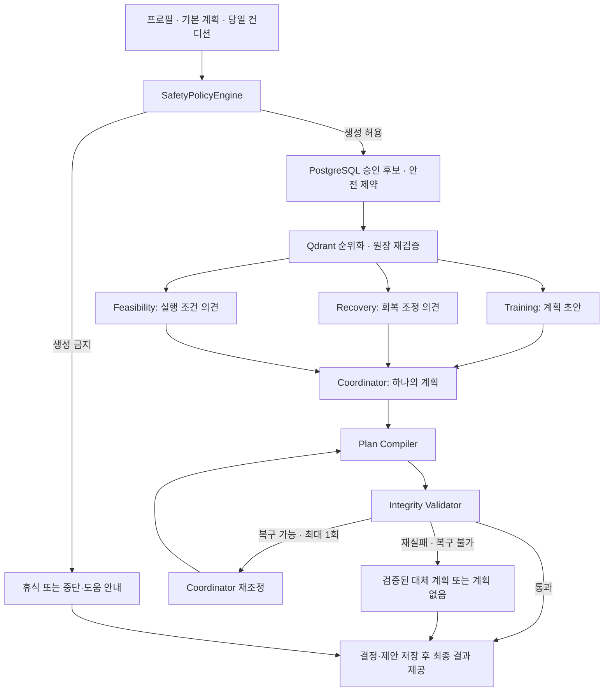

# 헬끼 (helkki)

> 매일 달라지는 몸 상태와 생활 조건에 맞춰 **오늘 실행 가능한 하나의 루틴**을 연결하고, 작은 실행과 회고를 다음 계획에 반영해 운동을 계속할 수 있도록 돕는 개인화 운동 웰니스 서비스입니다.

헬끼는 완벽한 계획이나 연속 기록을 강요하지 않습니다. 완료하지 않은 운동과 휴식도 다음 결정을 개선하는 신호로 받아들이며, 통증이나 이상 반응이 있을 때는 운동 지속보다 안전을 우선합니다. 의료 진단·치료·처방을 제공하지 않습니다.

## Team 콩닥

<table>
  <tr>
    <td align="center" width="25%">
      <br />
      <strong>채동현</strong><br />
      <sub>@chromerao</sub><br />
      <sub>개발 리드 · 데이터</sub><br /><br />
    </td>
    <td align="center" width="25%">
      <br />
      <strong>김범중</strong><br />
      <sub>@bumshark2</sub><br />
      <sub>프론트엔드</sub><br /><br />
    </td>
    <td align="center" width="25%">
      <br />
      <strong>장규원</strong><br />
      <sub>@gyuwon02</sub><br />
      <sub>백엔드</sub><br /><br />
    </td>
    <td align="center" width="25%">
      <br />
      <strong>박세빈</strong><br />
      <sub>@sebin1030</sub><br />
      <sub>PM · 문서 기획</sub><br /><br />
    </td>
  </tr>
</table>

## 서비스 한눈에 보기

| 항목 | 내용 |
|---|---|
| 소개 페이지 | [www.helkki.com](https://www.helkki.com) |
| 웹 서비스 | [app.helkki.com](https://app.helkki.com) |
| 주요 사용자 | 만 18~64세 일반 성인 중 운동 입문자·복귀자 |
| 핵심 흐름 | 기본 계획 → 당일 조정 → 실제 수행·중단 기록 → 주간 회고 → 다음 계획 |
| 현재 배포 범위 | AWS 웹 서비스. Android/iOS 스토어 출시는 별도 검증 대상 |
| 서비스 기능 검증 | 핵심 흐름 15/15 통과, 백엔드 CI 2,441건·프론트 회귀 736건 통과 |
| AI 구조 비교 결론 | 안전·전달 기준은 통과했으나, Single-Agent + RAG 대비 Multi-Agent의 비교 우위는 미입증 |

> **기준:** 2026-09-14 확인한 `develop` 구현과 2026-09-12 최종 테스트 보고서. 아래 테스트 수치는 해당 보고서의 실행 결과이며, 모든 후속 커밋을 대상으로 재실행한 결과는 아닙니다.

## 서비스가 해결하는 문제

운동 계획을 세운 뒤에도 수면, 피로, 통증, 일정과 장소는 매일 달라집니다. 계획을 그대로 수행하기 어려운 날에는 사용자가 운동 종류와 부담을 다시 판단하거나 대안을 찾아야 합니다. 한 번 건너뛴 뒤 다시 시작하는 과정도 사용자의 몫으로 남습니다.

팀의 자체 탐색 설문 **114명**에서 계획한 운동을 미루거나 포기한 경험은 **85.1%**, 실천이 어려워진 날 운동을 포기·미룬 응답은 **74.5%**, 한 번 건너뛴 뒤 다시 시작하기 어렵다는 응답은 **49.1%**였습니다. 포기·미룸 원인 중 당일 상태·환경은 **62.7%**였습니다. 각 수치는 서로 다른 문항의 응답이며 단계별 전환율이 아닙니다. 조사 방법과 표본 대표성에 한계가 있는 문제 탐색 자료로, 헬끼 사용 효과를 검증한 결과는 아닙니다.

헬끼는 **계획이 깨진 날의 조정과 미수행 이후의 복귀**에 집중합니다. 오늘 가능한 계획 하나를 제공하고, 수행 결과와 중단 이유를 다음 계획의 입력으로 남깁니다. 기존 운동 앱에도 개인화와 당일 조정 기능이 있으므로 기능의 독점성을 주장하기보다, 이 연결된 경험이 사용자에게 도움이 되는지 검증합니다.

### 핵심 원칙

- **하나의 최종 결과:** 최종 운동 루틴 하나를 제안합니다. 안전상 필요하면 휴식 또는 운동 중단·도움 안내가 결과가 됩니다.
- **요청 시간에 맞춘 조정:** 시간을 일괄적으로 줄이지 않고 운동 종류·난이도·세트·반복·휴식 구조를 조정합니다. 요청 시간 자체는 바꾸지 않으며, 승인 정책의 ±5분 범위에서 가장 가까운 계획을 선택합니다. 범위를 만족하지 못하면 계획을 반환하지 않습니다.
- **미수행 이유의 다음 계획 반영:** 완료·부분 수행·휴식·중단 사유를 다음 결정과 주간 계획에 사용합니다. 이는 모델 재학습을 의미하지 않습니다.
- **웨어러블 없이 이용:** 수동 컨디션 입력만으로 핵심 흐름을 이용할 수 있습니다.

## 주요 기능과 사용자 흐름

| 단계 | 구현 내용 |
|---|---|
| 로그인·온보딩 | Firebase 인증, 기본 정보·운동 목표·경험·주간 횟수 입력, 약관·건강정보 동의와 지원 범위 확인 |
| 오늘의 컨디션 | 수면·피로·통증·이상 신호, 가능한 시간과 장소를 입력하고 같은 날짜의 상태를 저장 |
| 오늘의 운동 | 기본 계획을 당일 조건에 맞춰 조정하고, 승인 후보 안의 최종 루틴 또는 휴식·중단 안내 제공 |
| 운동 실행 | 운동별 자세·설명, 타이머, 블록 완료·되돌리기, 중단과 안전 이벤트 처리 |
| 결과·회고 | 완료·부분 수행·미수행·안전 중단을 구분하고 체감 난이도·중단 사유를 저장 |
| 다음 주 계획 | 닫힌 주의 리포트를 열면 확인 상태를 자동 저장하고, 확인 후 다음 주 계획을 확정 |
| 끼끼의 집 | 캐릭터 상호작용, 바나나 잔액·사용, 일일·교감·미니게임 보상 API와 화면 제공 |

공식 운동 완료 여부는 **사용자가 앱에서 완료한 운동 블록**으로 계산합니다. 타이머 경과나 외부 운동·웨어러블 기록이 이를 대신하지 않습니다. 완료 블록이 없는 일반 중단은 홈에서 이어하기를 유지하는 반면, 통증·이상 반응에 따른 안전 중단은 당일 세션을 종료하고 재개를 차단합니다.

주간 리포트는 별도의 확인 버튼 없이 상세 화면을 정상적으로 연 뒤 자동으로 확인 처리합니다. 응답 유실 시 재시도하며, 확인되지 않은 리포트가 있으면 다음 주 계획 확정을 막습니다.

캐릭터·보상은 보조 동기 기능입니다. 운동을 놓쳤다고 기존 보상을 차감하거나 캐릭터가 실망을 표현하지 않습니다. 일부 주간 퀘스트는 표시와 후속 계약만 마련된 상태이므로 모든 퀘스트의 자동 보상 지급이 완료된 것으로 보지 않습니다.

## 시스템 구성

| 영역 | 기술·구성 | 역할 |
|---|---|---|
| 프론트엔드 | React Native · Expo · React Native Web · TypeScript | 웹·모바일 화면과 typed API client |
| 백엔드 | Python · FastAPI · Pydantic | `/api/v1` 요청 처리, 도메인 규칙과 애플리케이션 서비스 |
| 데이터 저장 | PostgreSQL · SQLAlchemy · Alembic | 사용자·운동·결정 이력 저장. AWS 배포에서는 Aurora PostgreSQL 사용 |
| AI 실행 | OpenAI API · LangChain · LangGraph | 구조화 제안, 역할별 병렬 실행, Coordinator 통합과 재조정 |
| 후보 검색 | Qdrant | PostgreSQL이 승인한 운동 범위 안의 순위화 |
| 인증 | Firebase · Google/Kakao OAuth 어댑터 | 공급자 인증 후 Firebase ID Token을 최종 API 권한으로 검증 |
| 배포·미디어 | AWS EC2 · Docker Compose · Caddy · S3 | API·웹 배포, HTTPS, 승인된 운동 미디어 제공 |
| 비밀정보·암호화 | AWS Secrets Manager · KMS | 배포 자격정보 주입과 생년월일 암호화 |
| 검증·관측 | pytest · Jest · GitHub Actions · LangSmith | 회귀·통합·안전 시험, 선택적 LLM 호출 추적 |

공개 웹 서비스는 승인된 **V3 `PRODUCTION` 실행 프로필**을 사용합니다. 이는 AI 실행 경로의 이름이며, 인프라는 EC2 기반 staging/demo 구성입니다. 고가용성 운영 구성을 뜻하지 않습니다. 로컬 기본 설정의 `LEGACY`·LLM 비활성과 실제 웹 배포 구성을 구분합니다.

Google과 Kakao의 서버 OAuth 초기화·코드 교환 경로가 구현되어 있습니다. 실제 웹 인증 E2E는 Google 재로그인으로 확인했으며, 이메일·Kakao는 자동화 계약 검증 범위입니다. Naver는 현재 구현 범위에 포함하지 않습니다.

배포 절차와 환경별 설정은 [배포 가이드](infra/deployment/README.md), [V3 운영 전환 문서](docs/runbooks/v3-production-promotion.md)를 따릅니다.

## Safety-first 추천 구조

안전 범위는 LLM이 정하지 않습니다. `SafetyPolicyEngine`이 생성 가능 여부와 승인 운동 범위를 먼저 고정하고, AI가 만든 계획은 조립 후 다시 검증합니다.



### 구성요소의 책임

| 구성요소 | 역할 | 책임의 경계 |
|---|---|---|
| SafetyPolicyEngine | 안전 상태, 제외 후보와 부담 상한을 결정하고 `ConstraintEnvelope` 생성 | Agent보다 먼저 실행되는 규칙 기반 엔진 |
| Training | 승인된 `ExercisePoolSnapshot`에서 계획 초안 작성 | 세 specialist 중 운동 처방을 만드는 유일한 Agent |
| Recovery | 수면·피로·통증 등 회복 관점의 `adjustment_codes` 제공 | Coordinator에 대한 권고이며 안전 규칙을 변경하지 않음 |
| Feasibility | 요청 시간·장소 등 실행 조건의 `adjustment_codes` 제공 | 계획을 별도로 생성하지 않음 |
| Coordinator | 초안과 조정 의견을 통합해 구조화된 `PlanSpec` 선택 | 승인 후보·안전 범위를 완화하지 않음 |
| Compiler·Validator | 실제 운동·시간을 조립하고 안전·장소·시간·카탈로그 제약 재검증 | 통과한 계획만 채택하며 실패 시 최대 1회 재조정 |

Agent와 Coordinator는 DB·Qdrant 검색 도구를 직접 갖지 않습니다. 애플리케이션이 조회·검증한 입력과 후보를 전달합니다. Qdrant 장애나 인덱스 불일치에는 결정적 후보 구성을 사용하고, 검색 결과도 PostgreSQL 원장과 재대조합니다. 계획 생성이 금지된 입력에는 운동 후보 검색과 Agent 호출을 실행하지 않습니다.

입력 스냅샷, 안전 제약, 운동 후보, 역할별 제안, 최종 결과와 정책·프롬프트 버전을 분리 저장해 실패 원인을 추적합니다. 저장된 정보의 재현성과 새 LLM 호출이 항상 같은 문장을 생성한다는 보장은 구분합니다.

## 데이터와 안전 기준

### 카탈로그와 적용 데이터

| 항목 | 확인된 상태 |
|---|---|
| 최종 비교 평가에 사용한 카탈로그 | `exercise-catalog-v2.0.7-final`, 운동 **237종** |
| 서비스 적용 안전 규칙 | 구조화된 규칙 레코드 **2,131건**. 독립된 의학 가이드라인 2,131개라는 의미가 아님 |
| 통합 데이터 | MET 출처·매핑·검수 정보를 운동별로 보존하고, 헬스장 안내 67건·집 생활도구 안내 34건 포함 |
| 후속 v2.0.8 | 번들·승격 스크립트와 `PASS_WITH_APPROVAL` 검증 산출물 존재. 이 사실만으로 실행 환경의 ACTIVE 버전을 단정하지 않음 |
| 추천 자격 | PostgreSQL의 승인·활성 상태와 안전·장소·장비 제약으로 결정 |
| 검색 역할 | Qdrant는 승인 자격을 만들지 않고 해당 범위 안에서 순위만 정함 |

운동 난이도는 `difficulty_code`로 관리합니다. 원천 설명을 그대로 금기나 처방량으로 변환하지 않으며, 미검수 항목은 추천 후보에서 제외합니다. 생성 번들의 파일·해시·건수 검증, 승인, DB 적재와 활성화는 각각 구분합니다.

v2.0.8에는 운동 family 식별, 유산소 시간 기준, 초기 FITT 처방 검토가 반영되어 있습니다. 데이터 상세는 [v2.0.8 검증 결과](data/reports/integrated_catalog_v2_0_8_final/promotion_candidate_validation.json), [번들 명세](data/generated/integrated-catalog-v2.0.8-final/catalog/bundle_manifest.json), [승격 스크립트](backend/scripts/catalog_promote_v2_0_8.py)를 참고하세요. 기존 비교 실험 수치를 새 카탈로그의 성능으로 재해석하지 않습니다.

### 근거와 적용 수준

| 근거 | 서비스에서의 활용 | 해석 범위 |
|---|---|---|
| WHO·CDC·질병관리청 | 일반 성인의 신체활동·강도·점진적 활동 원칙 | 서비스 대상과 일반 활동 원칙 참고 |
| ACSM 운동 전 건강 확인 | 흉부 불편·심한 숨참·어지럼 등 주요 이상 신호 | 운동 생성 중단 판단에 반영 |
| AASM·SRS 성인 수면 합의 | 수면을 회복 상태의 참고 정보로 사용 | 개인별 운동 가능 여부를 수면시간 하나로 판단하지 않음 |
| NRS 통증 숫자척도 | 통증 0~10 입력 | 척도 활용과 팀이 정한 제외·조정 구간을 구분 |
| 2024 Adult Compendium | 활동 강도와 MET 참고 매핑 | 개별 운동의 실제 에너지 소비량을 직접 측정한 결과가 아님 |
| Gymvisual · 국민체력100 · wger | 운동 후보·시범 동작·원천 메타데이터 | 출처와 검수·미디어 권리 조건에 따라 사용 |

통증 구간, 수면·피로 조합, 세트 조정 순서 등은 **제품 운영 기준**입니다. 공신력 있는 자료를 참고했다는 사실이 팀의 모든 임계값이나 임상적 안전성 검증을 뜻하지 않습니다. 원천·정규화·생성 데이터를 분리하고 출처·검수·권리 정보를 보존합니다. 상세는 [서비스 안전·적응 정책](docs/SERVICE_POLICY_SAFETY_AND_ADAPTATION_V1.md)을 따릅니다.

## 검증 결과

### 서비스 기능·배포 검증

**2026-09-12 보고서의 MVP 웹 서비스 배포 판정은 `통과`입니다.**

| 검증 | 결과 | 범위 |
|---|---:|---|
| 핵심 사용자 흐름 | **15/15 통과** | 인증·온보딩·컨디션·운동·안전 중단·주간 계획·계정 삭제 계약 |
| 백엔드 전체 CI | **2,441 passed** | 독립 PostgreSQL 16 통합 포함, 의도적 skip 3건 별도 |
| 프론트 전체 회귀 | **736 passed / 45 suites** | React Native 화면·API 경계 자동화 |
| DB release gate | **통과** | migration round trip, V1·V2 release flow |
| 실제 웹 연결 | **통과** | AWS staging의 Google 재로그인, 기존 프로필·주간 기록·운동 블록 조회 |
| Android/iOS export | **통과** | production bundle 생성. 스토어 출시·실기기 사용성 검증과 구분 |
| 최소 동시 요청 | **50/50 HTTP 200** | readiness 상태 확인 API에 한정 |

프론트의 mock·adapter 자동화, 독립 PostgreSQL 쓰기·통합 테스트, 실제 Firebase·Aurora 조회 E2E는 서로 다른 환경의 근거입니다. readiness 50건 결과를 운동 추천 API의 처리량으로 주장하지 않습니다. 재현 명령과 세부 판정은 [서비스 기능 테스트 보고서](docs/test/SERVICE_FUNCTIONAL_TEST_RESULTS.md)에 있습니다.

### Single LLM · Single-Agent + RAG · Multi-Agent + RAG 비교

역할을 나눈 구조가 실제로 도움이 되는지 동일 입력·모델·카탈로그·정책·compiler·validator 조건에서 비교했습니다.

| 구조 | 계획 생성 방식 | 비교 목적 |
|---|---|---|
| A. Single LLM | 검색 없이 단일 모델 호출 | 검색 제공 효과 확인 |
| B. Single-Agent + RAG | 단일 Agent에 승인 후보 검색 제공 | 주 비교 기준 |
| C. Multi-Agent + RAG | 세 specialist와 Coordinator에 승인 후보 제공 | 역할 분리의 추가 효과 확인 |

튜닝 20건과 구분한 평가 세트는 **33개 상황**으로, 계획 비교 29개와 AI 호출 전 안전 차단 4개로 구성했습니다. 수정 후 같은 33개를 재측정했으며, 서로 다른 버전의 실행 결과는 분리 보존했습니다. 세 구조의 planning 모델은 `gpt-5.6-terra:reasoning-low`로 동일하게 고정했습니다.

| 2차 최종 지표 | Single-Agent + RAG | Multi-Agent + RAG |
|---|---:|---:|
| 복잡 상황 LLM Plan Rate | **94.4% (17/18)** | **66.7% (12/18)** |
| 충돌 상황 LLM Plan Rate | 60.0% | 60.0% |
| 계획 대상 전체 LLM Plan Rate — 2회차 | 86.21% (25/29) | 72.41% (21/29) |
| 안전 규칙 준수율 | 100% | 100% |
| 응답시간 P95 | 40.390초 | 43.093초 |
| 평균 total tokens | 8,721.0 | 19,247.7 |

- **LLM Plan Rate**는 규칙 기반 대체 계획을 제외하고 모델이 직접 작성한 계획을 전달한 비율입니다. 복잡 상황은 9개 × 2회, 충돌 상황은 5개 × 2회를 합산했습니다. 나머지 표의 성능 수치는 보고서의 2회차 실행 기준입니다.
- Multi-Agent의 safety golden은 **33/33**, 위험 계획 검출은 **0건**, workflow completion은 **100%**였습니다. 절차 완료에는 대체 계획과 안전 차단이 포함되므로 AI 직접 생성률과 다릅니다.
- Multi-Agent의 평균 토큰은 동일 튜닝 세트에서 기존 Multi v1 대비 **26.98% 감소**했습니다. Single-Agent보다 토큰이 적다는 의미는 아닙니다.
- 사전 기준 6개 중 **4개 통과·2개 미달**입니다. Multi P95 목표 30초와 복잡·충돌 상황 비교 기준을 충족하지 못했습니다.
- Training은 생성 거절 상태를 표현할 수 있지만 baseline 계약에는 같은 상태가 없어, 계획 생성률 차이를 곧바로 계획 내용의 품질 차이로 해석할 수 없습니다. 사람·LLM Judge 점수도 독립성·편향 한계로 최종 합격·우열 판정에서 제외했습니다.

**멀티에이전트의 비교 우위는 이번 평가에서 입증되지 않았습니다.** 현재 구현은 V3 멀티에이전트 경로이며, 단순한 상황만 단일 Agent로 처리하는 조건부 분기는 아직 운영 구조가 아닙니다. 더 가벼운 단일 RAG 경로와 조건부 역할 분리는 후속 비교 과제입니다.

상세: [최종 품질 보고서](docs/test/TEST_RESULTS.md) · [2차 비교 결과](docs/test/ROUND2_HELDOUT_RESULTS.md)

### 검색 검증

| 지표 | 결과 |
|---|---:|
| 승인 후보 범위·필수 후보 보존 검사 | **8/8 통과** |
| Recall@5 | **0.6250** |
| MRR | **0.5156** |

실제 임베딩 `text-embedding-3-small` 256차원과 Qdrant local 환경의 8개 질의 결과입니다. 승인 범위 준수와 검색 순위 품질을 구분했습니다. 질의·운동 문서 표현을 정렬하고 순위 개선이 최종 계획에 미치는 영향을 추가 측정해야 합니다.

## 평가 과정과 이후 반영한 개선

| 개선 | 반영 내용 | 근거 |
|---|---|---|
| 역할별 응답 처리·입력 축소 | Training의 유효한 초안은 필수로 유지하고, Recovery·Feasibility의 `NEEDS_INPUT`을 안전 차단과 구분 | [ADR-0021](docs/adr/0021-v3-advisory-readiness-and-minimum-payload.md) |
| 재조정 경로·실패 코드 | 복구 가능한 위반이 실제 1회 재조정으로 이어지도록 연결하고 실패 원인을 분리 기록 | [ADR-0022](docs/adr/0022-repair-reachability-and-failure-code-separation.md) |
| Training 과도한 거절 개선 | 결정적 계획 후보 존재 여부를 사전 확인하고 안정된 거절 이유 코드 사용 | [ADR-0023](docs/adr/0023-training-decline-reason-and-feasibility-preflight.md) |
| Coordinator 불변 정보 | hash·참조·요청 시간 등 서버가 알고 있는 값은 서버가 조립하고 모델은 계획 내용에 집중 | [ADR-0024](docs/adr/0024-coordinator-server-owned-plan-identity.md) |
| 계획 family·시간 검증 | 운동 family 정보를 payload에 제공하고 시간 오차가 최종 검사·재조정으로 전달되도록 보완 | [2차 결과·후속 분석](docs/test/ROUND2_HELDOUT_RESULTS.md) |
| 운동·보상 UX | 일반 중단의 이어하기, 주간 리포트 자동 확인, 바나나 보상·미니게임 연동 | [서비스 기능 보고서](docs/test/SERVICE_FUNCTIONAL_TEST_RESULTS.md) · [보상 API](backend/app/api/v1/rewards.py) |

공통 V3 런타임의 변경은 `v3-prompts-v7`로 구분해 저장합니다. 공식 비교 종료 후 표적 2개 상황을 각 20회 실행한 결과는 **LLM 직접 계획 35/40, 계획 전달·안전 40/40**이었습니다. 이는 해당 실패 사례 개선을 확인한 보조 실측이며, 33개 공식 비교나 전체 사용자 성능을 대체하지 않습니다. 60개 확대 표본의 보조 분석도 기존 우위 미입증 결론을 바꾸지 않았습니다.

프론트 회귀 2건은 제품 결함 수정이 아니라 테스트 기대값을 실제 계약에 맞춘 수정입니다. 일반 중단 후 이어하기와 생년월일 wheel의 동일 인스턴스 동작을 검증하도록 정정했습니다.

## 사용자 검증과 다음 단계

기술 테스트는 구현과 안전 제약을 확인하는 근거입니다. **헬끼가 실제 운동 시작·복귀를 개선하는지는 아직 검증하지 않았습니다.** 자체 설문 114명은 문제 탐색이며 서비스 사용 실험이 아닙니다.

| 다음 검증 | 계획 |
|---|---|
| 사용성 | 타깃 사용자 10~15명이 온보딩·컨디션 입력·계획 확인·완료 또는 중단을 수행하고 과업 완료율·막힌 지점·추천 이해도 확인 |
| 실제 이용 | 2주 이상 관찰하며 운동 시작·부분 수행·미수행 이후 복귀 기록과 인터뷰를 함께 확인 |
| 핵심 지표 | 운동 시작률, 컨디션 저하일 수행률, 미수행 후 7일 이내 복귀율 |
| AI 구조·성능 | 단일 RAG와 조건부 역할 분리 비교, 추천 API의 지연·동시 요청 용량 측정 |
| 데이터 | 부위·장비·목표별 공백을 확인한 뒤 필요한 운동과 안전 규칙을 함께 검수·확대 |
| 입력 부담 | 실제 복귀 효과 검증 후 웨어러블 입력 자동화 검토 |

지표는 안전 차단·의도적 휴식을 분모에서 구분하고, 복귀율은 미수행 후 7일간 관찰 가능한 기록으로 산출합니다. 소규모 사용성 결과나 사용 의향을 전체 사용자의 행동 효과로 일반화하지 않습니다.

**HELKKI PASS 월 6,900원은 가격 가설**입니다. 추가 계획 조정·심화 주간 분석은 유료화 후보이며, 구독 화면의 존재가 결제 연동·유료 전환·수익성 검증 완료를 뜻하지 않습니다. 반복 사용 가치, 가격 수용도와 AI 운영 원가를 먼저 검증합니다.

## 알려진 범위와 후속 과제

- **배포:** 현재 웹 배포 판정과 Android/iOS 실기기·스토어 출시 검증을 구분합니다. EC2 기반 인프라의 고가용성 구성은 별도 과제입니다.
- **성능:** 추천 API의 정식 부하 시험과 용량 계획이 필요합니다. 상태 확인 API의 동시 50건으로 이를 대신하지 않습니다.
- **운영:** 웹 보안 응답 헤더, landing 정적 CSS, 웹 애니메이션·비동기 테스트 경고를 후속 개선 대상으로 관리합니다.
- **개인정보:** 계정 삭제 요청 후 접근 차단과 내부 계약은 검증했으며, 외부 provider 해제·백업 만료는 비동기 운영 절차로 추적합니다.
- **확장:** 임신·질환별 관리·치료·재활 등 현재 범위를 넓히려면 전문가 검토와 별도 검증이 필요합니다.
- **ML:** `ml/`의 synthetic/offline 활동 기록 예측은 별도 작업입니다. 서비스의 공식 운동 완료, 안전·강도·시간 판단에 연결하지 않습니다.

## 로컬 실행

### Backend

Python `3.12+`, `uv`, 접근 가능한 PostgreSQL이 필요합니다. 다음은 저장소 루트에서 실행하는 PowerShell 예시입니다. 환경 파일 복사 후 DB·인증 등 필요한 값을 로컬 환경에 맞게 설정하세요.

```powershell
uv sync --frozen --group dev
Copy-Item backend/.env.example .env
# .env의 로컬 DB·인증 설정 후 실행
uv run alembic -c backend/alembic.ini upgrade head
uv run uvicorn backend.app.main:app --reload
```

기본 설정만으로 실제 LLM·Qdrant 추천이 활성화되지는 않습니다. 외부 provider와 카탈로그의 승인·활성 상태 및 실행 프로필을 별도로 구성해야 합니다. 폐기 가능한 `_test`·`_demo` DB의 합성 데이터 준비는 [로컬 수직 슬라이스 가이드](docs/DEMO_VERTICAL_SLICE.md)를 따릅니다.

### Frontend

저장소의 `.nvmrc` 기준 Node `24.18.1`, npm `11`을 사용합니다.

```powershell
Set-Location frontend
npm ci
Copy-Item .env.example .env.local
# API 주소·Firebase 공개 설정을 로컬 환경에 맞게 설정
npm run web
```

Android Development Build는 `npm run android`, macOS의 iOS 환경은 `npm run ios`, 개발 클라이언트 서버는 `npm start`를 사용합니다. 웹 정적 산출물은 `npm run build:web`, Android/iOS production export는 `npm run build:production`으로 생성합니다.

### Docker 구성

`backend/Dockerfile`과 로컬·AWS 배포용 Compose가 포함되어 있습니다. 로컬 구성은 FastAPI·PostgreSQL 16·Qdrant를 제공합니다.

```powershell
Copy-Item infra/docker/.env.example infra/docker/.env
docker compose --env-file infra/docker/.env -f infra/docker/compose.yaml config
docker compose --env-file infra/docker/.env -f infra/docker/compose.yaml build api
docker compose --env-file infra/docker/.env -f infra/docker/compose.yaml up -d
```

컨테이너 기동과 migration·카탈로그 적재·AI 실행 프로필 설정은 구분합니다. 상세 순서는 [로컬 Docker 가이드](infra/docker/README.md), AWS 구성은 [배포 가이드](infra/deployment/README.md)를 참고하세요.

### 품질 검증 명령

```powershell
# 저장소 루트 — 통합 테스트에는 별도의 TEST_DATABASE_URL 필요
uv run ruff check backend data/scripts
uv run ruff format --check backend data/scripts
uv run mypy
uv run pytest

# frontend/
npm run format:check
npm run lint
npm run typecheck
npm test
npm run build:web
npm run build:production
```

실제 LLM 평가와 LangSmith 추적은 기본 테스트와 별도 실행합니다. 입력 최소화·비용·환경 조건은 [유료 평가 가이드](docs/test/PAID_EVALUATION.md)와 [LangSmith 추적 문서](docs/test/LANGSMITH_TRACING.md)를 확인하세요.

## 프로젝트 디렉터리

| 경로 | 역할 |
|---|---|
| `frontend/` | React Native·웹 화면, typed API client, 캐릭터·미니게임, 화면 테스트 |
| `backend/app/api/` | FastAPI HTTP adapter와 `/api/v1` route |
| `backend/app/modules/` | 사용자 흐름별 application service·schema·port |
| `backend/app/domain/` | Agent·Coordinator 계약과 안전·시간·주간 규칙 |
| `backend/app/db/` | SQLAlchemy model·repository |
| `backend/app/integrations/` | Firebase·소셜 OAuth·LLM·LangGraph·Qdrant 등 외부 연결 |
| `backend/migrations/`, `backend/scripts/` | Alembic migration, 카탈로그 승격·운영 명령 |
| `backend/tests/` | 단위·API·실제 DB 통합·안전 시나리오 테스트 |
| `data/` | 원천·정규화·생성 데이터, 검수·검증 산출물 |
| `docs/test/` | 서비스·AI·검색 평가 계획, 실행 결과와 재현 자료 |
| `docs/adr/`, `docs/runbooks/` | 설계 결정 이력과 운영 절차 |
| `infra/` | 로컬 Docker·AWS 배포 구성 |
| `ml/` | 서비스 runtime과 분리한 오프라인 검증 |

## 안전·개인정보 원칙

- 안전 판단은 규칙으로 먼저 고정하고 최종 계획 검사에서 강제합니다. LLM이 안전 veto를 무효화할 수 없습니다.
- 인증 토큰·직접 식별자·GPS 경로·원시 건강·웨어러블 샘플은 LLM에 전달하지 않습니다. 결정에 필요한 정규화된 최소 입력만 사용합니다.
- 건강정보 동의는 별도로 관리하고, 생년월일은 암호화해 저장합니다. 실제 secret·credential은 코드·문서·로그에 남기지 않습니다.
- 휴식 선택에 압박 알림을 추가하지 않으며, 통증·이상 반응 화면은 진지한 안내로 제공합니다.
- 미수행 이유는 다음 계획의 입력이며, 안전 검증 통과 수치는 임상적 안전성이나 운동 효과의 보장이 아닙니다.

## 주요 문서

| 목적 | 문서 |
|---|---|
| 서비스·정책 | [프로젝트 개요](docs/PROJECT_BRIEF.md) · [MVP 범위](docs/MVP_SCOPE.md) · [안전·적응 정책](docs/SERVICE_POLICY_SAFETY_AND_ADAPTATION_V1.md) |
| 설계·계약 | [아키텍처](docs/ARCHITECTURE.md) · [도메인 규칙](docs/DOMAIN_RULES.md) · [API 계약](docs/API_CONTRACT.md) · [데이터 모델](docs/DATA_MODEL.md) |
| 평가 계획·결과 | [테스트 계획](docs/test/TEST_PLAN.md) · [최종 품질 결과](docs/test/TEST_RESULTS.md) · [2차 비교](docs/test/ROUND2_HELDOUT_RESULTS.md) · [서비스 기능 결과](docs/test/SERVICE_FUNCTIONAL_TEST_RESULTS.md) |
| 개발·배포 | [로컬 개발](docs/LOCAL_DEVELOPMENT.md) · [Docker](infra/docker/README.md) · [AWS 배포](infra/deployment/README.md) |
| 개인정보 운영 | [계정 삭제 절차](docs/runbooks/account-deletion-operations.md) |
| 변경 이력·협업 | [문서 인덱스](docs/README.md) · [ADR 목록](docs/adr/README.md) · [협업 가이드](docs/COLLABORATION_GUIDE.md) |

과거 설계·작업 문서는 당시의 상태를 함께 보존합니다. 구현·배포 현황은 관련 코드와 최신 실행 보고서의 날짜·환경·버전을 함께 확인하세요.
