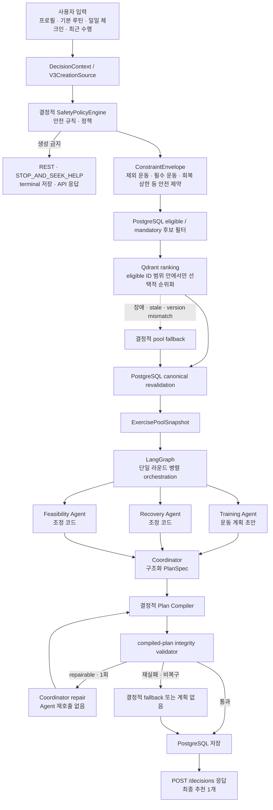

# 헬끼 (helkki)

> 매일 달라지는 몸 상태와 생활 조건에 맞춰 **오늘 실행 가능한 하나의 루틴**을 연결하고, 작은 실행과 회고를 다음 계획에 반영해 운동을 계속할 수 있도록 돕는 개인화 운동 웰니스 서비스입니다.

헬끼는 완벽한 계획이나 연속 기록을 강요하지 않습니다. 완료하지 않은 운동과 휴식도 다음 결정을 개선하는 신호로 받아들이며, 통증이나 이상 반응이 있을 때는 운동 지속보다 안전을 우선합니다. 의료 진단·치료·처방을 제공하지 않습니다.

## Team 콩닥

<table>
  <tr>
    <td align="center" width="25%">
      <br />
      <strong>채동현</strong><br />
      <sub>@chromerao</sub><br />
      <sub>개발 리드 · 데이터</sub><br /><br />
    </td>
    <td align="center" width="25%">
      <br />
      <strong>김범중</strong><br />
      <sub>@bumshark2</sub><br />
      <sub>프론트엔드</sub><br /><br />
    </td>
    <td align="center" width="25%">
      <br />
      <strong>장규원</strong><br />
      <sub>@gyuwon02</sub><br />
      <sub>백엔드</sub><br /><br />
    </td>
    <td align="center" width="25%">
      <br />
      <strong>박세빈</strong><br />
      <sub>@sebin1030</sub><br />
      <sub>PM · 문서 기획</sub><br /><br />
    </td>
  </tr>
</table>

## 서비스가 해결하는 문제

운동을 시작하거나 다시 시작해도 피로, 수면, 통증, 일정과 장소는 매일 달라집니다. 고정된 계획이 이런 현실과 충돌하면 무리해서 수행하거나 계획 전체를 포기하기 쉽고, 실패 중심 피드백은 다음 시작을 더 어렵게 만듭니다.

헬끼는 온보딩에서 만든 기본 계획을 오늘의 조건에 맞게 조정합니다. 운동을 완료하지 않은 이유와 휴식 선택을 페널티가 아닌 다음 결정의 입력으로 저장하고, 일일 결정과 주간 회고에 반영해 장기적인 재시작 가능성을 높입니다.

## 핵심 가치

- **오늘 실행 가능한 하나의 추천**: 여러 계획을 동시에 공개하지 않고 최종 추천 루틴 하나를 제공합니다. 필요한 경우 REST 또는 안전상 중단 안내가 최종 결과가 됩니다.
- **안전 우선 조정**: 통증·이상 반응과 검수된 규칙을 결정 과정에 반영하며, 안전한 후보를 만들 수 없으면 운동 계획을 반환하지 않습니다.
- **수행 결과의 다음 계획 반영**: 앱 안에서 기록한 완료·미완료·중단 결과와 피드백을 다음 결정과 주간 계획의 입력으로 사용합니다. 이는 모델 재학습을 의미하지 않습니다.
- **주간 회고**: 닫힌 주의 수행 리포트를 확인하고 acknowledgement한 뒤 다음 주 계획을 확정합니다.

## 실제 사용자 흐름

알파 시연은 프론트엔드가 호출하는 `/api/v1` API와 PostgreSQL에 저장되는 데이터를 기준으로 진행됩니다.

```mermaid
flowchart LR
  AUTH["Firebase 인증"] --> PROFILE["GET /me · 프로필 확인"]
  PROFILE --> ONBOARD["PUT /me/onboarding · 온보딩 저장"]
  ONBOARD --> ROUTINE["POST /routines · 기본 루틴"]
  ROUTINE --> CHECKIN["PUT /daily-contexts/{local_date}"]
  CHECKIN --> DECIDE["POST /decisions"]
  DECIDE --> CHOICE["POST /decisions/{id}/selection"]
  CHOICE --> START["PATCH /workout-sessions/{id}/start"]
  START --> BLOCK["PATCH /workout-sessions/{id}/items/{item}"]
  BLOCK --> RESULT["finish · not-completed · safety-event"]
  RESULT --> FEEDBACK["POST /workout-sessions/{id}/feedback"]
  FEEDBACK --> REPORT["주간 리포트 조회·acknowledgement"]
  REPORT --> PLAN["다음 주 계획 확정"]
  PLAN --> CHECKIN
```



프론트엔드는 인증·온보딩·홈·운동·주간 리포트 화면을 typed API client로 연결합니다. 위 흐름은 mock 응답이 아니라 FastAPI route와 PostgreSQL 저장을 기준으로 하며, 로컬 시연에서 synthetic Catalog를 쓰더라도 호출과 저장은 실제 DB/API를 사용합니다. 운동의 공식 완료 상태는 경과 시간이나 웨어러블 데이터가 아니라 앱에서 사용자가 완료한 운동 블록으로 계산합니다. 세션 상태는 `COMPLETED`, `PARTIAL`, `NOT_COMPLETED`, `STOPPED_FOR_SAFETY`를 사용합니다.

## 현재 아키텍처 구조

결정 생성은 정규화된 사용자 입력에서 시작해 Safety-first 제약을 먼저 고정하고, 그 제약 안에서만 운동 후보와 Agent 입력을 만듭니다. 이 실행 경로는 staging `DEMO` 또는 승인된 `PRODUCTION` 실행 프로필에서 구성되며, 기본 설정에서는 명시적으로 비활성입니다.



`SafetyPolicyEngine`은 Agent보다 먼저 `ConstraintEnvelope`를 고정합니다. 계획 생성을 허용하지 않으면 운동 후보·Qdrant·Agent를 호출하지 않고 terminal 결과를 저장합니다. 허용된 경우에도 Safety 제약은 compiler와 compiled-plan integrity validator까지 이어지므로, Agent나 Coordinator가 임의로 무효화할 수 없습니다.

### Agent와 Coordinator의 역할

| 구성요소 | 입력·출력 | 책임 |
|---|---|---|
| Training Agent | 같은 `ConstraintEnvelope`·`ExercisePoolSnapshot` → `exercise_prescriptions` | 승인 pool 안에서 운동 계획 초안을 만드는 유일한 Agent입니다. |
| Recovery Agent | 같은 envelope·pool → `adjustment_codes` | 회복 관점의 조정 코드를 Coordinator에 권고합니다. |
| Feasibility Agent | 같은 envelope·pool → `adjustment_codes` | 시간·장소 등 실행 조건 관점의 조정 코드를 Coordinator에 권고합니다. |
| Coordinator | 세 구조화 proposal + envelope·pool → `PlanSpec` | 세 응답을 종합해 하나의 구조화 계획을 선택합니다. DB·Qdrant를 직접 조회하거나 새 안전 기준을 만들지 않습니다. |

세 Agent와 Coordinator는 LangChain adapter를 통해 Pydantic 구조화 출력을 교환하며, LangGraph가 병렬 실행·fan-in·한 번의 repair·fallback을 orchestration합니다. Training만 운동 계획을 만들고, Recovery·Feasibility의 조정 코드는 권고이므로 결정론적으로 강제하지 않습니다. 최종 안전 강제 지점은 Coordinator 이후 compiled plan을 검사하는 integrity validator입니다. Agent proposal, envelope, pool snapshot, 최종 결과와 버전 정보는 PostgreSQL에 분리 저장됩니다.

## Multi-Agent 필요성 검증

현재는 Multi-Agent의 효과나 우위를 결론으로 확정하지 않습니다. 동일한 입력 컨텍스트·후보 데이터·정책 조건에서 Single-Agent baseline과 비교 테스트를 진행한 뒤, 평가 기준·결과·Multi-Agent 채택 근거를 이 섹션에 추가합니다.

## 주요 기능 구현 범위

| 영역 | 현재 코드 기준 상태 |
|---|---|
| 인증·프로필·동의 | Firebase ID Token 경계, `/me`, 온보딩·프로필 수정, 동의 현재 상태와 이력 API가 있습니다. |
| 루틴·일일 결정 | 기본 루틴 생성, 일일 컨텍스트 저장, `POST /api/v1/decisions`, 결정 조회와 idempotency 처리가 있습니다. |
| 운동 실행 | 세션 시작, 블록별 완료·되돌리기, 타이머 이벤트, 추가 운동, 안전 이벤트와 종료 API가 있습니다. 타이머 자체는 공식 완료를 만들지 않습니다. |
| 주간 루프 | 주간 리포트 조회·acknowledgement와 다음 계획 확정 전 게이트가 있습니다. |
| 소셜 인증 | Kakao/Naver 교환 route는 아직 구현되지 않았으며, 현재 인증은 Firebase ID Token 경계를 사용합니다. |
| 재생성 | API와 서비스 경계가 있으나 Safety-first 실행 프로필과 regeneration gate가 필요합니다. 기본 설정에서는 비활성입니다. |

## Catalog·difficulty·Qdrant

운동 추천 후보는 PostgreSQL의 승인된 Catalog에서 구성합니다. Catalog v2는 운동 단위 `difficulty_code`(`BEGINNER`, `INTERMEDIATE`)를 사용하며, 과거 `beginner_suitable` 필드는 신규 추천 기준으로 사용하지 않습니다.

현재 v2.0.2 산출물은 생성되었지만 backend import·승인·activation 검증이 끝나지 않아 현재 활성 Catalog로 간주하지 않습니다. 실행 환경의 Catalog 버전과 승인 상태는 [Catalog 모듈 문서](backend/app/modules/catalog/README.md)와 [v2.0.2 적재 작업](docs/tasks/TASK-CATALOG-V2_0_2-IMPORT.md)에서 관리합니다.

Qdrant는 Safety-first 실행 경로에서만 선택적으로 후보를 순위화하는 검색 계층입니다. PostgreSQL이 승인·활성 후보의 원장이고, 검색 결과는 다시 검증하며, Qdrant 장애나 불일치에는 결정적 fallback을 사용합니다. 기본 설정에서는 Qdrant가 꺼져 있습니다. 자세한 경계는 [Qdrant 통합 문서](backend/app/integrations/qdrant/README.md)를 따릅니다.

## 데이터 출처와 활용

헬끼는 운동 후보와 결정 규칙을 구조화하고 검증하기 위해 다음 출처를 사용합니다.

| 출처·산출물 | 현재 확인된 활용 |
|---|---|
| 국민체력100(KSPO) | 운동 원천·영상 메타데이터 수집과 후보 검토 |
| wger | 운동 카탈로그 원천 데이터 |
| WHO·CDC·질병관리청 | 일반 신체활동·강도·FITT 근거 |
| 2024 Adult Compendium | 활동 강도와 관련된 보조 기준 |
| Gymvisual | 별도 권리·콘텐츠 검토가 필요한 자세·설명 보강 데이터 |

원천 데이터와 정규화·생성 데이터를 분리하고, manifest에 출처·라이선스·수집 시각·식별 정보를 보존합니다. 상세 근거는 [데이터 수집 보고서](data/reports/DATA_COLLECTION_REPORT.md)와 [데이터 전처리 결과서](data/reports/DATA_PREPROCESSING_REPORT.md)를 확인하세요.

## ML 경계

`ml/`은 검증과 산출물 제작을 위한 별도 작업 공간입니다. 현재 서비스의 backend/frontend, Agent 결정, Safety, Catalog 추천, 실제 E2E 흐름에는 머신러닝 모델이 포함되지 않습니다.

ML 작업의 활동 기록 예측은 synthetic/offline 데이터로 검증하며, 앱의 공식 운동 완료 상태를 결정하지 않습니다. ML 결과는 안전·REST·강도·난이도·시간·압박 알림 판단에 사용하지 않습니다. 작업 범위는 [ML 작업 계획](docs/ML_WORK_PLAN.md)을 따릅니다.

## 프로젝트 디렉터리 구조

```text
frontend/                         React Native 앱, typed API client, 화면과 component 테스트
backend/
├─ app/api/                       FastAPI HTTP adapter와 /api/v1 route
├─ app/modules/                   application use case, schema와 port
├─ app/domain/agents/             구조화 proposal, runner와 Coordinator 계약
├─ app/domain/rules/              안전·시간·복귀 등 결정적 도메인 규칙
├─ app/db/                        SQLAlchemy model과 repository
├─ app/integrations/              Firebase·Qdrant·LangGraph 경계
├─ migrations/                    Alembic revision과 migration 환경
└─ tests/                         unit·API·PostgreSQL integration·golden scenario 테스트
data/                             raw·normalized·generated 운동 데이터와 검증 pipeline
ml/                               오프라인 검증·산출물 제작 작업
docs/                             제품·아키텍처·도메인·API·데이터 계약과 ADR
infra/                            배포·운영 문서와 환경 예시
```

## 로컬 실행 방법

저장소에는 실행 가능한 Dockerfile이나 Docker Compose가 없습니다. 호스트에서 PostgreSQL을 준비하고, 저장소 루트에서 backend와 frontend를 각각 실행합니다.

### Backend

Python `3.12+`, `uv`, 접근 가능한 PostgreSQL이 필요합니다. `backend/.env.example`을 참고해 로컬 환경 변수를 설정하고, 실제 secret이나 credential 파일은 저장소에 두지 않습니다.

```powershell
uv sync --frozen --group dev
Copy-Item backend/.env.example .env
uv run alembic -c backend/alembic.ini upgrade head
uv run uvicorn backend.app.main:app --reload
```

폐기 가능한 `_test` 또는 `_demo` DB와 `APP_ENV=local` 또는 `test` 환경에서만 로컬 수직 슬라이스용 synthetic catalog를 적재합니다.

```powershell
uv run python -m backend.scripts.demo_seed seed
```

### Frontend

프론트엔드 기준 환경은 Node `24.18.1`, npm `11`입니다.

```powershell
Set-Location frontend
npm ci
Copy-Item .env.example .env.local
npm start
```

Android Development Build는 `npm run android`, macOS의 iOS 환경에서는 `npm run ios`, 웹 확인은 `npm run web`을 사용합니다.

### 검증 명령

```powershell
# 저장소 루트
uv run ruff check backend data/scripts
uv run ruff format --check backend data/scripts
uv run mypy
uv run pytest

# frontend/
npm run format:check
npm run lint
npm run typecheck
npm test
npm run build:production
```

자세한 준비와 환경 경계는 [로컬 개발 가이드](docs/LOCAL_DEVELOPMENT.md), [backend README](backend/README.md), [frontend README](frontend/README.md)를 확인하세요.

## 구현 현황

| 구분 | 영역 | 현재 상태 |
|---|---|---|
| 구현 완료 | Firebase 인증 경계, 프로필·동의, 기본 루틴, 일일 체크인·결정, 운동 세션, 주간 리포트·계획 | 관련 API route, application service, model/repository와 테스트가 저장소에 있습니다. |
| 통합·검증 중 | Safety-first 멀티에이전트 runtime, `SafetyPolicyEngine`, compiler·integrity validator | staging `DEMO`와 승인된 `PRODUCTION` 프로필에 한해 구성됩니다. 기본 설정에서는 비활성입니다. |
| 구현 완료 | React Native 주요 화면과 typed API 연결 | 온보딩, 홈 체크인·결정, 운동, 결과, 주간·프로필 흐름이 연결되어 있습니다. 실제 기기와 외부 서비스가 결합된 운영 E2E는 별도 검증이 필요합니다. |
| 통합·검증 중 | Catalog v2.0.2 backend import·승인·activation·Qdrant snapshot | 산출물은 있으나 importer/content/approval/activation 검증이 끝나지 않아 현재 서비스 활성 상태로 간주하지 않습니다. |
| 후속 작업 | Kakao/Naver 소셜 인증, secret manager·backup 만료, wearable 연동, 배포 선언 | port·경계 또는 문서 일부만 있으며 운영 연결과 증적이 필요합니다. |
| 별도 작업 | `ml/` 오프라인 검증과 산출물 | 서비스 runtime과 연결하지 않습니다. |

## 안전·개인정보 원칙

- 헬끼는 의료 서비스가 아니며 진단·치료·처방 또는 의학적 효능을 주장하지 않습니다.
- Safety 관련 결정은 결정적 규칙과 검증으로 보호합니다. LLM이나 Coordinator가 명시적 안전 veto를 무효화할 수 없고, 안전한 후보가 없으면 계획을 반환하지 않습니다.
- 인증 토큰, 이메일, 전체 이름, 직접 식별자, GPS 경로, 원시 건강·웨어러블 샘플을 LLM에 전달하지 않습니다.
- 공식 완료 상태는 앱의 운동 블록 완료 기록으로만 판단합니다. 경과 타이머·외부 운동·웨어러블은 이를 대신하지 않습니다.
- 사용자가 REST를 선택한 날에는 추가 압박 알림을 보내지 않으며, 마스코트는 미완료나 건너뛰기에 실망을 표현하지 않습니다.
- 미완료 기록은 페널티가 아니라 다음 계획을 위한 신호입니다. 통증·이상 반응 화면은 진지하고 비유희적인 어조를 사용합니다.

## 주요 문서

- [문서 우선순위 및 변경 규칙](docs/README.md)
- [프로젝트 개요](docs/PROJECT_BRIEF.md)
- [MVP 범위](docs/MVP_SCOPE.md)
- [아키텍처](docs/ARCHITECTURE.md)
- [기술 계획](docs/TECHNICAL_PLAN.md)
- [도메인 규칙](docs/DOMAIN_RULES.md)
- [API 계약](docs/API_CONTRACT.md)
- [데이터 모델](docs/DATA_MODEL.md)
- [로컬 개발 가이드](docs/LOCAL_DEVELOPMENT.md)
- [테스트 전략](docs/TEST_STRATEGY.md)
- [협업 가이드](docs/COLLABORATION_GUIDE.md)
- [ADR 목록](docs/adr/README.md)
