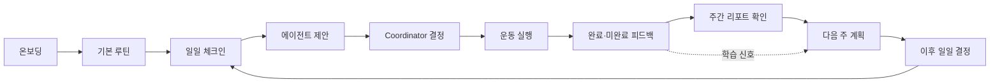
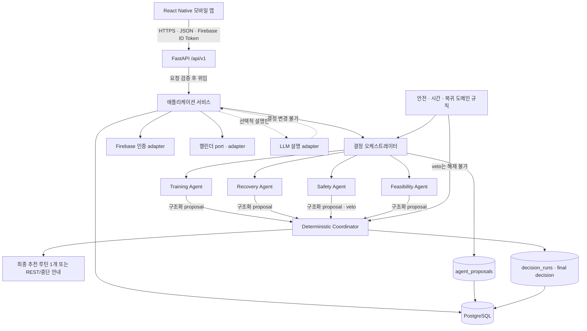
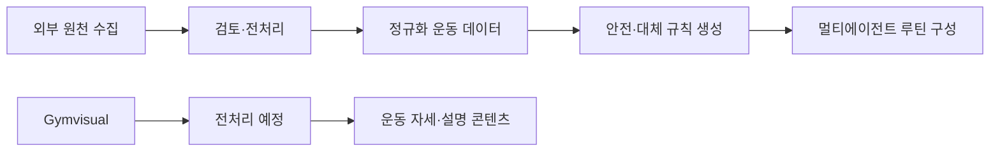

# 헬끼 (helkki)

> 매일 달라지는 몸 상태와 생활 조건에 맞춰 **오늘 실행 가능한 하나의 루틴**을 연결하고, 작은 실행과 회고를 다음 계획에 반영해 운동을 계속할 수 있도록 돕는 개인화 운동 웰니스 서비스입니다.

헬끼는 완벽한 계획이나 연속 기록을 강요하지 않습니다. 완료하지 않은 운동과 휴식도 다음 결정을 개선하는 신호로 받아들이며, 통증이나 이상 반응이 있을 때는 운동 지속보다 안전을 우선합니다. 의료 진단·치료·처방을 제공하지 않습니다.

## Team 콩닥


<table>
  <tr>
    <td align="center" width="25%">
      <br />
      <strong>채동현</strong><br />
      <sub>@chromerao</sub><br />
      <sub>개발 리드 · 데이터</sub><br /><br />
    </td>
    <td align="center" width="25%">
      <br />
      <strong>김범중</strong><br />
      <sub>@bumshark2</sub><br />
      <sub>프론트엔드</sub><br /><br />
    </td>
    <td align="center" width="25%">
      <br />
      <strong>장규원</strong><br />
      <sub>@gyuwon02</sub><br />
      <sub>백엔드</sub><br /><br />
    </td>
    <td align="center" width="25%">
      <br />
      <strong>박세빈</strong><br />
      <sub>@sebin1030</sub><br />
      <sub>PM · 문서 기획</sub><br /><br />
    </td>
  </tr>
</table>

## 서비스가 해결하는 문제

운동을 시작하거나 다시 시작해도 피로, 수면, 통증, 일정, 장소와 장비는 매일 달라집니다. 고정된 계획이 이런 현실과 충돌하면 무리해서 수행하거나 계획 전체를 포기하기 쉽고, 지나치게 어려운 계획과 실패 중심 피드백은 다음 시작을 더 어렵게 만듭니다.

헬끼는 기존 목표를 버리거나 새 루틴을 끝없이 추천하는 대신, 온보딩에서 만든 기본 계획을 오늘의 조건에 맞게 조정합니다. 운동을 완료하지 않은 이유와 휴식 선택도 페널티가 아닌 학습 신호로 저장하고, 일일 결정과 주간 회고에 반영해 장기적인 재시작 가능성을 높입니다.

## 핵심 가치

- **오늘의 컨디션에 맞는 운동**: 당일 상태와 시간·장소·장비 등 생활 조건을 반영해 실행 가능한 루틴을 구성합니다.
- **컨디션에 따라 조정되는 하나의 추천**: 여러 대안을 나열하지 않고, 사용자 상태에 맞춰 구성한 최종 추천 루틴 하나를 제공합니다.
- **수행 피드백이 다음 루틴으로 연결**: 운동 후 입력한 수행 결과와 상태·컨디션을 멀티에이전트의 다음 루틴 결정에 학습 신호로 반영합니다. 이는 모델 재학습이 아니라 다음 결정의 입력으로 사용하는 것을 뜻합니다.
- **주간 수행 현황 리포트**: 주간 루틴 수행률과 진행 현황을 확인할 수 있는 리포트를 제공할 예정입니다.
- **웨어러블 선택 연동**: 선택적으로 연동할 수 있도록 지원할 예정이며, 연동하지 않으면 수동 입력으로 필요한 정보를 대체합니다.

## 핵심 사용자 흐름



운동의 공식 완료 상태는 경과 시간이 아니라 앱 안에서 사용자가 완료한 운동 블록을 기준으로 계산합니다. 모든 블록을 완료하면 `COMPLETED`, 일부만 완료하면 `PARTIAL`, 완료 블록이 없으면 `NOT_COMPLETED`, 안전 문제로 중단하면 `STOPPED_FOR_SAFETY`입니다.

## 주요 기능

| 기능 | 현재 범위 |
|---|---|
| 온보딩과 개인화 프로필 | 만 14세 이상 적격성 확인, 목표·경험·장소·장비·희망 시간·주의 부위·동의 저장과 프로필 설정 변경 API가 구현되어 있습니다. |
| 기본·주간 루틴 | 버전형 기본 루틴과 주간 계획의 초기 생성, AI 또는 사용자 revision, 확정 게이트가 구현되어 있습니다. |
| 일일 컨디션 체크인 | 피로, 수면, 희망 시간, 장소, 불편 부위와 이상 반응을 사용자 로컬 날짜별로 저장합니다. |
| 다중 에이전트 제안 | Training·Recovery·Safety·Feasibility Agent가 공통 후보에 대해 구조화된 proposal을 반환합니다. 필수 proposal의 누락·실패에는 계획을 반환하지 않습니다. |
| 결정적 Coordinator | 네 proposal, 요청 시간과 검수 후보를 종합해 하나의 최종 추천을 선택합니다. 동일한 입력과 버전으로 결정을 재현하는 계약을 갖습니다. |
| 안전 veto와 대체 운동 | 검수된 안전 규칙으로 충돌 운동을 제외하고 승인된 대체 관계를 적용합니다. Safety의 `BLOCKED`와 veto는 Coordinator나 LLM이 해제할 수 없습니다. |
| 운동 실행과 블록 기록 | 결정 선택, 세션 시작, 블록 완료·되돌리기, 타이머 이벤트, 추가 운동, 안전 이벤트와 세션 종료를 저장합니다. |
| 수행 결과와 피드백 | `COMPLETED`, `PARTIAL`, `NOT_COMPLETED`, `STOPPED_FOR_SAFETY` 상태와 난이도·불편·미완료 이유를 기록합니다. |
| 주간 폐쇄 루프 | 닫힌 주의 리포트 생성·조회·확인과 다음 계획 확정 전 확인 게이트가 구현되어 있습니다. |
| 캘린더 외부 컨텍스트 | PostgreSQL 모델·repository·provider port와 합성/비활성 adapter가 구현되어 있습니다. 공개 Calendar API route와 실제 Google OAuth·secret-manager 운영 연결은 후속 작업입니다. |
| 계정·동의·개인정보 수명주기 | 동의 현재 상태와 append-only 이력, 계정 삭제 요청 즉시 접근 차단, 운영 데이터 삭제 기한과 비식별 감사 상태가 구현되어 있습니다. 실제 백업 만료와 외부 provider 해제는 운영 adapter가 필요합니다. |
| 웨어러블·소셜 OAuth | 공식 계약은 정의되어 있지만 웨어러블 모델·공개 route와 Kakao/Naver 교환 route는 아직 구현되지 않았습니다. Firebase 기본 인증과 수동 체크인 경로는 구현되어 있습니다. |

## 멀티 에이전트 서비스 구조



API route는 요청과 인증을 검증한 뒤 application service에 위임하고, 비즈니스 규칙과 안전 판단은 `domain`과 `modules`에 둡니다. 에이전트 proposal과 최종 결정은 별도 레코드로 저장하며, 입력 snapshot과 카탈로그·정책·안전·시간·그래프·Coordinator 버전을 함께 보존해 재현성을 확보합니다. 선택적 LLM adapter는 검수된 reason code를 설명 문장으로 바꾸는 역할만 하며, 실패하면 같은 결정에 템플릿 설명을 사용합니다.

## 기술 스택

| 구분 | 기술 |
|---|---|
| Mobile | React Native · TypeScript · Expo |
| Backend | Python · FastAPI · Pydantic |
| AI/Agent | 결정적 규칙 기반 멀티에이전트<br />병렬 Proposal → Coordinator 조정 → Safety veto |
| Data | PostgreSQL · SQLAlchemy · Alembic |
| Auth | Firebase Authentication |
| Quality | Ruff · mypy · pytest · Jest · GitHub Actions |

## 데이터 수집 및 활용

헬끼의 데이터 파이프라인은 운동 후보를 구조화하고, 결정적 안전·대체 규칙과 멀티에이전트의 루틴 결정을 검증하기 위해 구성했습니다. 상세 근거는 [데이터 수집 보고서](data/reports/DATA_COLLECTION_REPORT.md)와 [데이터 전처리 결과서](data/reports/DATA_PREPROCESSING_REPORT.md)에서 확인할 수 있습니다.

### 1차 수집·전처리 완료 데이터

| 원천·산출물 | 확보 및 처리 결과 |
|---|---|
| 국민체력100(KSPO) | 원천 1,668행, 동영상 243개, 운동명이 있는 파일–운동 쌍 391개 |
| wger | 운동 862개, 번역 3,312개, 장비 12종 등 운동 카탈로그 데이터 |
| 공식 신체활동 지침 | WHO·CDC·질병관리청 등 원천 5종과 일반 성인 FITT·강도 관련 사실 14건 |
| 2024 Adult Compendium | MVP 관련 활동 20건 |
| 운동 후보 검토 | 총 121개 중 56개 포함, 65개 제외, 미결 0개 |
| 파생 데이터 | 최종 56개 운동을 바탕으로 안전 규칙 354건과 대체 운동 관계 238건 생성 |

> 위 데이터는 1차 수집과 전처리를 완료했지만 현재 모두 `DRAFT`, `production_eligible=false` 상태입니다. 외부 운동·의료 전문가의 운영 승인을 받은 추천 데이터가 아니며 운영 DB에도 적재하지 않았습니다.

### 활용 목적

- 사용자 목표·장소·장비에 맞는 운동 후보 구성
- 불편 부위에 따른 결정적 안전 필터
- 장소·장비·난이도를 고려한 대체 운동 탐색
- 멀티에이전트의 루틴 제안과 Coordinator 결정 지원
- FITT·강도 기준 및 데이터 골든 시나리오 검증

수집 출처는 국민체력100 공공데이터, wger, WHO, CDC, 질병관리청, 2024 Adult Compendium입니다. 원천 데이터와 정규화·생성 데이터를 분리하고, 각 원천의 라이선스·저자·수집 시각·출처 식별 정보를 매니페스트에 보존합니다. 원천 영상·이미지 바이너리와 공식 문서 원문은 재배포하지 않습니다.

### 데이터 흐름



### Gymvisual — 전처리 미진행 데이터

Gymvisual 데이터는 운동 자세와 운동 설명 콘텐츠를 보강하기 위해 활용할 예정입니다. 아직 전처리·정규화·서비스 DB 반영을 진행하지 않았으며, 현재의 안전 규칙이나 추천 판단에는 사용하지 않습니다.

> 출처: © Aliaksandr Makatserchyk - Gym visual
>
> Gymvisual로부터 직접 사용 허가를 받았습니다.

## 프로젝트 디렉터리 구조

```text
frontend/                         React Native 앱, typed API client, 화면과 component 테스트
backend/
├─ app/api/                       FastAPI HTTP adapter와 /api/v1 route
├─ app/modules/                   application use case, schema와 port
├─ app/domain/agents/             구조화 proposal, runner와 Coordinator 계약
├─ app/domain/rules/              안전·시간·복귀 등 결정적 도메인 규칙
├─ app/db/                        SQLAlchemy model과 repository 구현
├─ app/integrations/              Firebase·캘린더·선택적 LLM adapter
├─ migrations/                    Alembic revision과 migration 환경
└─ tests/                         unit·API·PostgreSQL integration·golden scenario 테스트
data/                             raw·normalized·generated 운동 데이터와 검증 pipeline
docs/                             제품·아키텍처·도메인·API·데이터 계약과 ADR
infra/                            Docker·배포 운영 문서와 환경 예시(실행 선언은 미제공)
```

## 로컬 실행 방법

현재 저장소에는 실행 가능한 Dockerfile이나 Docker Compose가 없습니다. 호스트에서 PostgreSQL을 준비하고, 저장소 루트에서 백엔드와 프론트엔드를 각각 실행합니다.

### 1. 백엔드와 PostgreSQL

Python `3.12+`, `uv`, 접근 가능한 PostgreSQL이 필요합니다. 예시 파일을 복사한 뒤 `.env`의 `DATABASE_URL`, Firebase test project, 동의·온보딩 설정을 본인의 로컬 환경에 맞게 채웁니다. 실제 secret이나 credential 파일은 저장소 안에 두지 않습니다.

```powershell
uv sync --frozen --group dev
Copy-Item backend/.env.example .env
uv run alembic -c backend/alembic.ini upgrade head
uv run uvicorn backend.app.main:app --reload
```

로컬 수직 슬라이스용 합성 카탈로그가 필요하면 이름이 `_test` 또는 `_demo`로 끝나는 폐기 가능한 DB와 `APP_ENV=local` 또는 `test`에서만 다음 명령을 사용합니다. 이 데이터는 실제 도메인 검수를 받은 운영 데이터가 아닙니다.

```powershell
uv run python -m backend.scripts.demo_seed seed
```

### 2. 프론트엔드

프론트엔드 기준 환경은 Node `24.18.1`, npm `11`입니다. `frontend/.env.example`을 `.env.local`로 복사하고, 기기에서 접근 가능한 API 주소와 Firebase의 공개 클라이언트 설정만 입력합니다.

```powershell
Set-Location frontend
npm ci
Copy-Item .env.example .env.local
npm start
```

Android Development Build는 `npm run android`, macOS의 iOS 환경에서는 `npm run ios`, 웹 확인은 `npm run web`을 사용합니다.

### 3. 검증 명령

```powershell
# 저장소 루트: 백엔드·데이터
uv run ruff check backend data/scripts
uv run ruff format --check backend data/scripts
uv run mypy
uv run pytest
uv run alembic -c backend/alembic.ini upgrade head --sql

# frontend/: 프론트엔드
npm run format:check
npm run lint
npm run typecheck
npm test
npm run build:production
```

자세한 준비와 환경 경계는 [로컬 개발 가이드](docs/LOCAL_DEVELOPMENT.md), [백엔드 README](backend/README.md), [프론트엔드 README](frontend/README.md)를 확인하세요.

## 구현 현황

| 상태 | 영역 | 확인 근거와 남은 작업 |
|---|---|---|
| 구현 확인 | Firebase 인증 경계, 프로필·동의, 루틴, 체크인, 결정, 운동 세션, 주간 리포트·계획, 계정 삭제 | `/api/v1` route, application service, SQLAlchemy model, Alembic migration과 관련 자동화 테스트가 저장소에 존재합니다. 이번 README 작업에서는 전체 테스트를 재실행하지 않았습니다. |
| 구현 확인 | 네 proposal Agent, Coordinator, 안전·시간 규칙, 결정 재현·설명 fallback | domain/module 구현과 unit·golden scenario·persistence test가 존재합니다. 선택적 OpenAI 설명 adapter의 기본값은 비활성입니다. |
| 구현 확인 | React Native 핵심 화면과 API 연결 | 온보딩, 홈 체크인·결정, 운동, 주간 리포트, 프로필 화면과 typed API client, component test가 존재합니다. 실제 기기·Firebase·PostgreSQL을 함께 사용한 운영 환경 E2E는 별도 검증이 필요합니다. |
| 기반 구현 | Google Calendar | ORM·migration, repository, port, 합성/비활성 provider와 테스트가 존재합니다. 공개 route, 실제 Google API adapter, OAuth credential·secret-manager와 운영 증적은 필요합니다. |
| 계약·후속 | Kakao/Naver 소셜 OAuth와 웨어러블 | 공식 문서 계약은 있으나 현재 `/api/v1` router와 ORM에 해당 공개 구현이 없습니다. Google 로그인은 Firebase 기본 provider 경로를 사용합니다. |
| 운영 연결 필요 | 배포, Docker, 외부 secret·backup 수명주기 | `infra/`에는 책임과 예시만 있으며 실행 가능한 Compose/Dockerfile·배포 선언은 없습니다. 실제 provider, secret manager와 backup 만료 증적도 운영 연결이 필요합니다. |

## 안전·개인정보 원칙

- 헬끼는 의료 서비스가 아니며 진단·치료·처방 또는 의학적 효능을 주장하지 않습니다.
- 결정적 안전 규칙과 Safety Agent의 veto는 Coordinator와 LLM이 무효화할 수 없습니다. 안전한 후보를 만들 수 없으면 운동 계획을 반환하지 않습니다.
- 웨어러블은 선택 사항이며 단독으로 안전을 판단하지 않습니다. 미연동·권한 거부·장애 시 수동 체크인을 사용합니다.
- LLM에는 인증 토큰, 이메일, 전체 이름, 생년월일, 직접 식별자, 캘린더 본문, GPS 경로, 원시 건강·웨어러블 샘플을 전달하지 않습니다.
- 공식 완료 상태는 앱 안의 운동 블록 완료 기록으로만 판단합니다. 경과 타이머, 웨어러블, 캘린더와 외부 운동은 이를 변경하지 않습니다.
- 사용자가 `REST`를 선택한 날에는 추가 압박 알림을 보내지 않으며, 마스코트는 미완료나 건너뛰기에 실망을 표현하지 않습니다.
- 미완료 기록은 페널티나 연속 기록 파괴가 아니라 다음 계획을 위한 학습 신호입니다.
- 통증·이상 반응 화면은 진지하고 비유희적인 어조를 사용하며, 운동 지속보다 중단과 보수적인 안내를 우선할 수 있습니다.

## 주요 문서

- [문서 우선순위 및 변경 규칙](docs/README.md)
- [프로젝트 개요](docs/PROJECT_BRIEF.md)
- [MVP 범위](docs/MVP_SCOPE.md)
- [아키텍처](docs/ARCHITECTURE.md)
- [기술 계획](docs/TECHNICAL_PLAN.md)
- [도메인 규칙](docs/DOMAIN_RULES.md)
- [API 계약](docs/API_CONTRACT.md)
- [데이터 모델](docs/DATA_MODEL.md)
- [로컬 개발 가이드](docs/LOCAL_DEVELOPMENT.md)
- [테스트 전략](docs/TEST_STRATEGY.md)
- [협업 가이드](docs/COLLABORATION_GUIDE.md)
- [ADR 목록](docs/adr/README.md)
