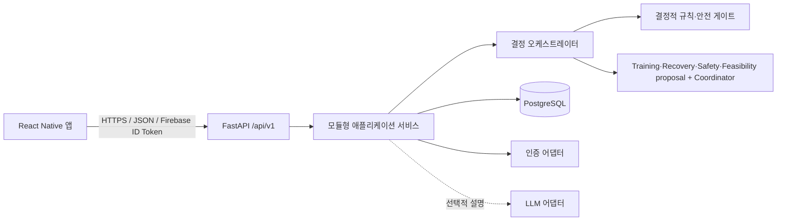
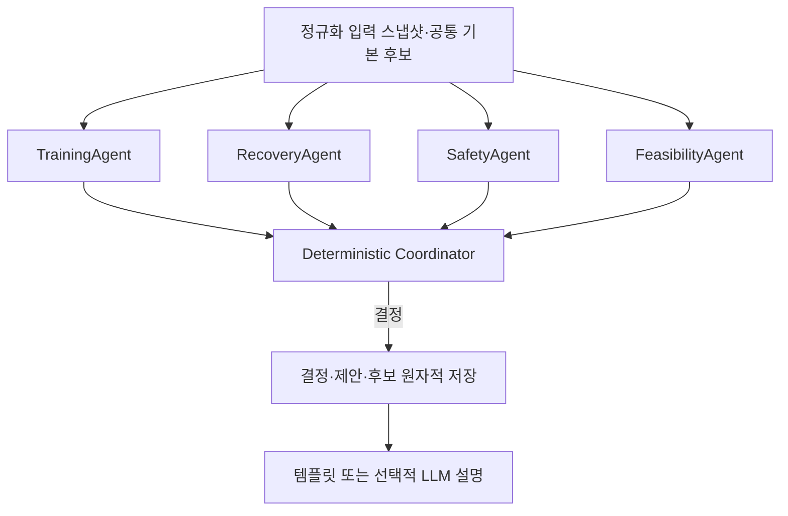
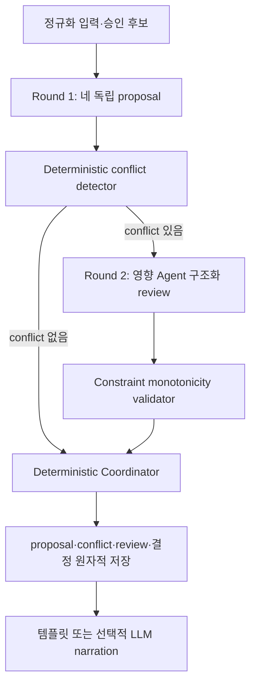
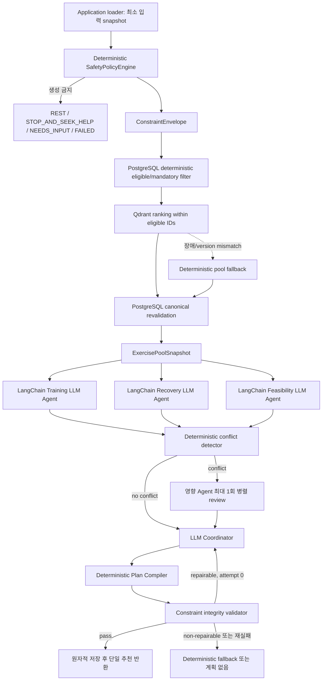
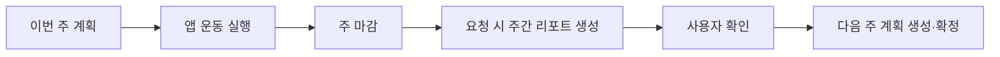

# ARCHITECTURE.md

## 1. 결정

초기 시스템은 React Native 모바일 앱, FastAPI 모듈형 모놀리스, PostgreSQL로 구성한다. 멀티에이전트는 별도 서비스가 아니라 백엔드 도메인 내부의 독립된 결정 모듈로 구현한다.

멀티 에이전트 핵심 흐름은 Training·Recovery·Safety·Feasibility 네 proposal의 병렬 실행과 Coordinator 최종 결정으로 확정한다. 에이전트 내부 상세 흐름과 공개 요약 필드는 증상 사용자 시나리오 검증 결과에 따라 추후 보완할 수 있다. 독립적인 최종 Safety 재검사는 현재 범위에 포함하지 않는다.

ADR-0012는 이 활성 흐름 사이에 결정적 conflict detection과 최대 한 번의 구조화 review를 넣는
V2 목표를 채택한다. A2 기준 구현과 필수 검증이 병합되기 전까지 production 기준은 ADR-0007의
현재 단일 proposal 흐름이며, ADR 승인을 V2 구현 완료로 간주하지 않는다.

ADR-0013은 Safety를 결정적 정책 엔진으로 선행하고 Training·Recovery·Feasibility와 Coordinator를
LLM Agent로 전환하며 LangChain·LangGraph를 도입하는 V3 목표 계약으로 `ACCEPTED`되었다. 구현·비교
검증과 production 전환 승인 전에는 아래 V1/V2 production 기준을 대체하지 않는다. ADR-0014는
ExercisePool의 Qdrant retrieval 세부 계약을 `PROPOSED` 상태로 추가한다.



이유:

- 4명 팀이 한 배포 단위에서 명확한 모듈 경계를 유지할 수 있다.
- 하나의 결정이 사용자, 루틴, 안전 규칙, 후보, 제안, 선택을 일관되게 저장해야 한다.
- 안전과 재현성을 네트워크 경계보다 코드·데이터 계약으로 강제하기 쉽다.
- 웨어러블·캘린더·LLM 장애가 수동 체크인을 포함한 핵심 흐름에 영향을 주지 않는다.

대안은 에이전트별 마이크로서비스와 워크플로 프레임워크다. 독립 배포·대규모 병렬 처리가 필요해질 때 재검토할 수 있으나, MVP에서는 운영 복잡성과 분산 트랜잭션 비용 때문에 선택하지 않는다.

## 2. 실행 및 배포 단위

핵심 MVP의 실행 단위는 다음 둘뿐이다.

1. 모바일 앱
2. FastAPI API 프로세스와 PostgreSQL

주간은 사용자 timezone 기준 월요일 00:00부터 일요일 23:59까지다. 주 마감은 날짜로 논리 계산하고, 주간 리포트는 사용자가 요청할 때 동기 생성한다. 따라서 초기에는 Redis, Celery, scheduler, Kafka가 필요하지 않다.

알림, 대량 집계, 외부 동기화가 실제 MVP 범위에 들어오고 동기 요청으로 처리할 수 없을 때만 worker와 queue를 별도 ADR로 검토한다.

## 3. 백엔드 모듈 경계

| 모듈 | 책임 | 의존 가능 대상 | 금지 |
|---|---|---|---|
| `identity` | Firebase 토큰 검증, 내부 사용자·외부 identity 연결, 삭제 차단 | integrations, repositories | 운동 규칙 판단 |
| `profiles` | 온보딩과 사용자 선호 | repositories, catalog lookup | 안전 임계값 판단 |
| `catalog` | 검수 운동·대체·FITT·출처 조회 | repositories | 미검수 콘텐츠 추천 |
| `routines` | 기본·주간 루틴과 버전 | catalog, policies | API에서 직접 생성 규칙 수행 |
| `checkins` | 당일 컨텍스트와 불편 입력 | repositories | 진단 또는 상태 추정 |
| `decisions` | 요청 스냅샷, 후보, 제안, 조정, 최종 결과 | rules, agents, catalog | 자유 형식 운동 생성 |
| `workouts` | 0초 경과 타이머 기록, 운동 블록 체크, 완료·부분·미수행·안전 중단 | decisions, repositories | 시간이나 웨어러블로 공식 완료 확정 |
| `weekly_reports` | 닫힌 주의 집계, 리포트 생성·확인, 다음 계획 게이트 | workouts, routines | 열린 주를 최종 리포트로 확정 |
| `integrations` | Firebase, 소셜 OAuth 교환, 웨어러블·캘린더 어댑터, 선택적 LLM | 외부 SDK/API | 도메인 결정 소유 |

모듈 간 호출은 공개 service/port를 통하고, 다른 모듈의 repository나 ORM model을 직접 조작하지 않는다.

Calendar는 `external-context-policy-v2`에 따라 integration adapter가 Google 원본을 즉시 normalized
freebusy 구간으로 바꾸고 application service에는 raw payload나 token을 전달하지 않는다. event link는
공식 block completion을 소유한 `workout_session_id`를 참조하고, Calendar 관찰값은 workout 상태나
safety veto를 변경할 수 없다. DB에는 opaque credential reference만 두며 실제 credential은 별도
secret-manager port 뒤에 둔다.

## 4. 결정 파이프라인



MVP에서는 Training·Recovery·Safety·Feasibility 네 proposal Agent를 병렬 실행하고 Coordinator가 의견과 우선순위를 종합해 최종 운동 계획을 결정한다. 네 proposal 중 하나라도 누락되거나 `FAILED`이면 결정 실행은 `FAILED`이며 운동 계획을 성공 응답하지 않는다. 독립적인 Safety 최종 재검사는 현재 범위에 포함하지 않는다.

### 4.1 승인된 V2 목표 — bounded structured deliberation

ADR-0012에 따라 다음 목표 흐름을 A2의 framework-independent domain core로 먼저 검증한다.



- Round 1 누락·`FAILED`·`NEEDS_INPUT`은 Round 2로 진행하지 않는다.
- conflict가 있을 때만 영향받는 Agent를 한 번 review한다. 비대상 Agent와 no-conflict의 네 Agent는
  Agent 호출 없는 `NOT_REQUIRED` event로 기록해 누락과 생략을 구분한다.
- review는 다른 proposal의 machine code·hash·constraint만 읽고 자유 텍스트 토론을 하지 않는다.
- Safety veto·제외는 완화할 수 없고 요청 시간·승인 후보·버전은 Round 2에서 바꿀 수 없다.
- 미해결 충돌에서 모든 hard constraint를 만족하는 후보가 없으면 계획을 반환하지 않는다.
- integrity validator는 기존 Safety 의견 보존을 검사할 뿐 독립적인 FinalSafetyGate가 아니다.

### 4.2 승인된 V3 목표 — Safety-first LLM Agent orchestration



- LangGraph는 위 node·conditional edge·fan-out/fan-in과 bounded repair를 orchestration한다.
- LangChain은 세 전문 Agent와 Coordinator의 provider adapter, prompt, Pydantic structured output을
  담당한다.
- SafetyPolicyEngine, constraint builder, conflict detector, compiler와 validator는 framework와
  provider에 독립적인 Python/Pydantic domain core다.
- application loader가 PostgreSQL에서 승인된 eligible/mandatory 운동 ID를 결정적으로 먼저 계산한다.
  ADR-0014 승인 시 별도 Qdrant derived index는 eligible 범위 안의 순위·다양성만 정하고, 결과를 같은
  catalog version의 PostgreSQL에서 다시 조회·검증한 뒤 canonical `ExercisePoolSnapshot`을 고정한다.
- 필수 목표 운동과 승인 안전 대체는 Vector 결과와 무관하게 보존한다. Qdrant 장애·stale/version
  mismatch는 결정적 pool fallback으로 처리하며 Safety 결과를 바꾸지 않는다.
- Agent와 Coordinator는 DB·repository·ORM·raw SQL·Qdrant Tool을 갖지 않는다.
- 최종 validator는 안전 규칙을 다시 해석하지 않고 실제 compiled plan이 확정 envelope를 준수하는지만
  검사한다.
- persistent LangGraph checkpointer는 V3 첫 구현에 포함하지 않는다. PostgreSQL decision record가
  canonical source of truth다.

V3는 승인된 목표 구조지만 아직 미구현이다. V1/V2 historical 실행과 response를 보존하고 구현·검증
후 별도 production 전환 승인으로 새 `graph_version`에서만 활성화한다.

## 5. 에이전트 책임

- `TrainingAgent`: 주간 FITT와 목표 태그, CORE 보존 제약을 제안한다.
- `RecoveryAgent`: 피로·수면·최근 부하·불편·복귀 상한을 제안한다.
- `SafetyAgent`: 통증·금기·환경 조건을 기준으로 `PASS/NEEDS_INPUT/REVISE/BLOCKED`와 위험 운동·수정 의견을 제안한다. `BLOCKED` 의견은 Coordinator가 우선 반영한다.
- `FeasibilityAgent`: 정규화된 공통 입력과 공통 기본 후보만 받아 가능 시간·장소·장비·일정·선호·기피 조건을 반영한 실제 수행 가능한 종류·순서·구성·대체안을 제안한다.
- `Coordinator`: 네 proposal과 공통 기본 후보, 사용자 목표·선호·요청 운동 시간을 종합해 최종 루틴·FITT 조정안·변경 이유를 결정한다.

V3 목표에서는 Safety를 Agent 목록에서 제거하고 결정적 `SafetyPolicyEngine`으로 승격한다.
Training은 승인 운동 pool 안에서 PlanSpec 초안을 만들고, Recovery와 Feasibility는 회복 상한과 실행
가능성 proposal을 만들며, LLM Coordinator는 이를 종합·선택한다. Coordinator는 DB를 조회하거나
새 안전 기준을 만들지 않는다.

Coordinator는 운동 계획을 반환하는 경우 계획 구성요소의 합계인 `estimated_duration_seconds`를 `requested_duration_minutes * 60`과 정확히 일치시킨다. 검수된 후보와 안전 규칙만으로 정확히 구성할 수 없으면 시간을 임의로 축소·초과하지 않고 계획을 반환하지 않는다. 이 값은 계획 단계의 hard target이며 실제 경과 시간이나 완료 판정의 기준은 아니다.

조정기는 운동을 자유 생성하거나 안전 veto를 해제하지 않는다. LLM은 reason code를 설명 문장으로 바꾸는 선택 기능일 뿐이다.

현재 멀티 에이전트의 네 proposal 병렬 실행과 Coordinator 결정은 확정한다. proposal·Coordinator·회의 UI의 상세 필드는 증상 사용자 시나리오 검증 결과에 따라 보완할 수 있으며 공개 요약은 내부 추론을 포함하지 않는다.

V2 목표에서 각 Agent는 Round 1 hard constraint와 preference를 분리하고, Round 2에서는 영향받은
preference만 수정한다. Safety veto·제외, Feasibility 불가능 조건, 승인된 Recovery ceiling과
요청 시간은 다른 Agent의 선호로 완화할 수 없다. Training 목표까지 동시에 보존할 승인 후보가
없으면 목표를 임의 교체하지 않고 계획 없는 기존 상태로 종료한다.

## 6. 안전 상태와 최종 액션

안전 평가와 사용자용 운동 액션을 분리한다.

| SafetyStatus | 의미 | 계획 |
|---|---|---|
| `PASS` | 안전 규칙 통과 | 허용 |
| `NEEDS_INPUT` | 필수 안전 입력 부족 | 없음 |
| `REVISE` | 충돌 후보 제거·대체 필요 | Coordinator가 수정 후보에 반영 |
| `BLOCKED` | 현재 입력으로 운동 제공 불가 | 없음 |
| `FAILED` | 필수 규칙·에이전트·저장 실패 | 없음 |

최종 액션은 `KEEP`, `DOWNSHIFT`, `CHANGE`, `RECOVERY`, `REST`, `STOP_AND_SEEK_HELP`다. 심한 국소 불편·급성 근골격 신호의 `BLOCKED`는 `REST`, 중대한 이상 반응의 `BLOCKED`는 `STOP_AND_SEEK_HELP`로 표현한다.

## 7. 인증 경계

클라이언트가 사용하는 최종 세션 권한은 Firebase ID Token이다.

- 첫 구현 provider: ADR-0009 승인 뒤 Kakao authorization-code/OIDC adapter를 독립 PR로 추가하고
  Firebase custom token으로 교환한다.
- Google: 기존 Firebase 기본 provider 경로만 사용하며 backend 직접 OAuth adapter를 중복 구현하지 않는다.
- Naver: Kakao 수직 슬라이스 안정화, 공개 서비스 검수와 token 영구 저장 없는 해제 계약 승인 뒤 추가한다.
- FastAPI: Firebase ID Token만 최종 권한으로 검증한다.
- DB: 기존 `user_identities`에 additive `identity-social-v1` KAKAO row를 추가한다. Firebase
  principal 분리는 실제 명시적 다중-provider 연결 요구가 생길 때 별도 설계한다.

provider subject 검증은 signature, issuer, audience, expiry, subject와 지원 provider의 nonce를
확인한 뒤 최소 `(provider_code, provider_subject)`만 반환한다. 이메일 링크와 Apple 로그인은 MVP
이후 후보다. 공급자 token, 이메일, 전체 이름, 닉네임, 전화번호와 원시 provider 응답은 운동
도메인 DB와 로그에 저장하지 않는다. 상세 계약과 공식 문서 근거는 `PROPOSED` ADR-0009와
`auth-provider-policy-v1`을 따른다.

## 8. 주간 폐쇄 루프



공식 수행 상태는 운동 블록의 사용자 완료 체크로 `COMPLETED`, `PARTIAL`, `NOT_COMPLETED`, `STOPPED_FOR_SAFETY` 중 하나가 된다. 0초부터 증가하는 경과 타이머, 웨어러블과 외부 운동은 참고 신호이며 공식 완료를 확정하지 않는다.

## 9. 운동 실행 화면 경계

```text
┌──────────────────────────────┐
│ 00:00부터 증가하는 경과 타이머 │
├──────────────────────────────┤
│ 현재 운동 마스코트 애니메이션  │
├──────────────────────────────┤
│ 운동 블록 1  [자세·설명 펼침]  │
│ 운동 블록 2  [자세·설명 펼침]  │
│ 운동 블록 3  [자세·설명 펼침]  │
└──────────────────────────────┘
```

- 서버는 운동 유형, 상·하체 등 초점, 운동 순서, 세트·반복·권장 목표, 검수 설명을 제공한다.
- 클라이언트는 상단 경과 타이머, 중앙 마스코트, 하단 블록과 체크·격파·좌측 밀기 제스처를 표현한다.
- 모든 제스처는 동일한 plan item 완료 API로 귀결된다.
- 경과 시간은 정보값이며 블록이나 세션을 자동 완료하지 않는다.
- 다음 운동은 서버의 sequence 중 첫 PENDING 블록이다.

## 10. 데이터와 트랜잭션 경계

- PostgreSQL이 단일 진실 공급원이다.
- decision run, 네 proposal, 후보, Safety 평가, Coordinator 결정 결과를 분리 저장한다.
- V2 목표는 conflict detector 결과, `NOT_REQUIRED`를 포함한 review event와 revised proposal을
  Coordinator 결과와 분리해 additive하게 저장한다. 물리 schema는 별도 migration 승인이 필요하다.
- V3 목표는 ConstraintEnvelope, ExercisePoolSnapshot, 세 LLM proposal, model/prompt/output schema
  version, conflict/review, Coordinator initial/repair attempt, compiler/validator 결과와 regeneration
  lineage를 분리 저장한다.
- ADR-0014 승인 시 V3 목표는 catalog, collection, vector index, embedding model, query, retrieval
  request/result와 deterministic fallback version을 PostgreSQL에 함께 저장한다. Qdrant는 canonical
  decision 기록이 아니다.
- LangGraph runtime state나 checkpoint를 canonical decision 기록으로 사용하지 않는다.
- 성공 응답 전에 해당 결정 기록이 원자적으로 저장돼야 한다.
- 주간 리포트는 닫힌 주의 불변 집계 스냅샷과 생성 정책 버전을 저장한다.
- 주간 리포트는 패턴 요약, 조정 방향, 다음 행동과 잠정 agent summary를 함께 저장한다.
- 체중 기반 예상 소모 칼로리는 참고 정보로 저장하며 진단·안전 판정의 단독 근거로 사용하지 않는다.
- `user_consents`는 일반·민감·웨어러블·캘린더·마케팅 동의의 현재 상태를 저장하고, `user_consent_events`는 동의·철회 append-only 이력을 저장한다. 모든 동의 mutation은 두 테이블의 현재 상태 갱신과 event 추가를 하나의 트랜잭션으로 처리한다.
- JSONB는 입력 스냅샷·proposal·확장 메타데이터에만 사용한다.
- 계정 삭제 요청 즉시 접근을 막고 운영 DB 사용자 연결 데이터는 7일 이내, 백업은 30일 이내 만료한다.

## 11. 오류와 폴백

| 실패 | 동작 |
|---|---|
| 선택 입력 누락 | unknown 유지, 추론 금지 |
| 필수 안전 입력 누락 | `NEEDS_INPUT`, 필요한 필드만 반환 |
| 필수 규칙·전문 에이전트 실패 | `FAILED`, 계획 없음 |
| 안전 후보 없음 | `BLOCKED` + `REST` |
| DB 저장 실패 | 성공 응답 금지 |
| LLM 실패 | 같은 결정과 검수 템플릿 |
| 웨어러블 없음 | 수동 체크인 정상 흐름 |
| 중복 mutation | 저장된 멱등 응답 반환 |

V3에서는 필수 LLM Agent나 provider 실패 시 부분 proposal로 Coordinator를 실행하지 않는다. 동일한
envelope를 만족하는 결정적 fallback을 compiler·validator로 검증해 반환하고, 안전한 fallback이 없으면
원인별 계획 없는 상태로 종료한다. Coordinator repair는 repairable violation에 한 번만 허용한다.

## 12. 로컬 및 MVP 배포

로컬 목표 구성은 mobile app, API, PostgreSQL이다. 실행 가능한 Compose 파일은 기반 구현 단계에서 API와 환경 변수가 확정된 뒤 추가한다.

MVP 배포는 관리형 PostgreSQL 하나와 컨테이너 또는 단일 애플리케이션 런타임의 FastAPI 하나, 모바일 빌드 배포로 시작한다. 특정 클라우드 공급자는 아직 고정하지 않는다. Kubernetes, 별도 agent service, Redis, object storage는 기본 구성에 포함하지 않는다.

## 13. 선택하지 않은 대안

- 에이전트 마이크로서비스: 작은 팀에서 배포·인증·추적 비용이 크다.
- V1/V2의 LangGraph 기본 도입: 현재 production 흐름에는 필요하지 않다. ADR-0013 V3는 병렬
  fan-out/fan-in, 조건부 review, bounded repair와 regeneration 재진입 때문에 LangGraph runtime을
  제안하되 persistent checkpointer는 별도 승인 전까지 사용하지 않는다.
- Redis/Celery/scheduler: 요청 시 리포트와 동기 결정에 필요하지 않다.
- 벡터 DB/RAG: 검수된 정규화 카탈로그 조회 문제에 맞지 않는다.
- 이벤트 소싱: 감사 요구를 충족하는 명시적 기록 테이블보다 복잡하다.
- LLM 후보 생성: 안전·재현성 계약을 약화한다.

## 14. 아직 확정되지 않은 사항

- 배포 클라우드, 리전, 비용 상한
- LLM 설명 기능의 실제 MVP 활성화 여부와 비용 상한. 공급자와 경계는 ADR-0011에서 OpenAI adapter로
  고정했고 기본값은 비활성이다.
- ADR-0012 V2의 기준 구현 비교 결과와 LangGraph 채택 여부
- ADR-0013 V3의 필수 승인, production model·비용·latency 기준과 snapshot freshness TTL
- 소셜 OAuth provider별 앱 심사 일정과 Firebase custom token 운영 방식
- 수면·부하·복귀 볼륨의 외부 검수된 수치
- 외부 도메인 검수자와 승인 증적 형식
- 운동 완료 제스처를 체크 버튼, 격파, 좌측 밀기 중 어떤 조합으로 제공할지

## 15. 팀 확인 질문

- Google/Kakao/Naver 앱 등록과 비밀값을 누가 소유하는가?
- 첫 파일럿의 사용자 timezone은 다지역을 지원하는가, 한국 시간만 허용하는가?
- 주간 리포트 명시적 확인 버튼의 최종 문구와 배치는 무엇인가?
- 배포 환경은 데모 1개인지 staging과 production을 분리할지?
