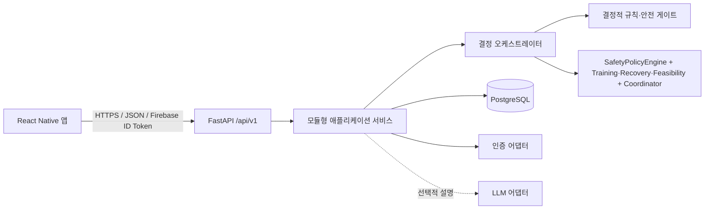
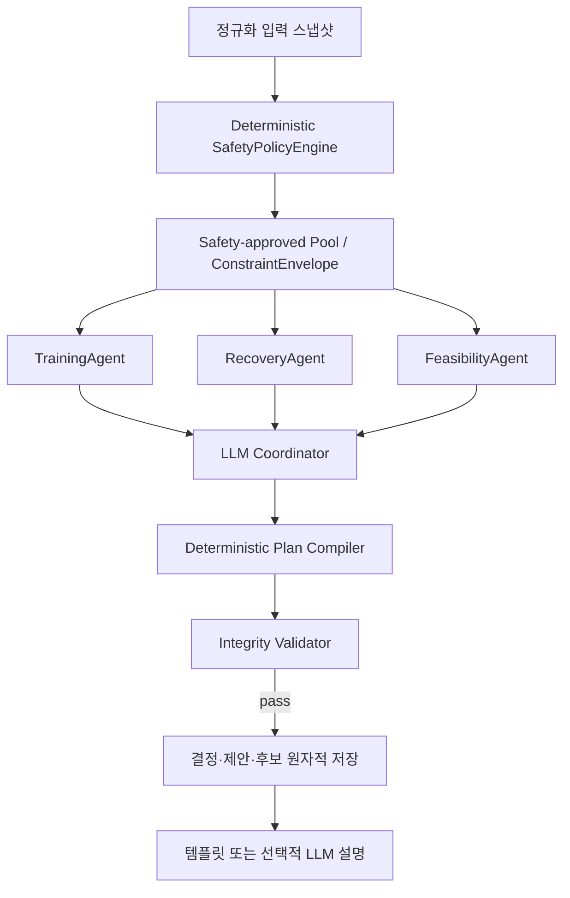
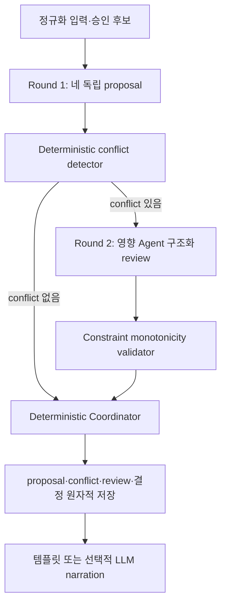
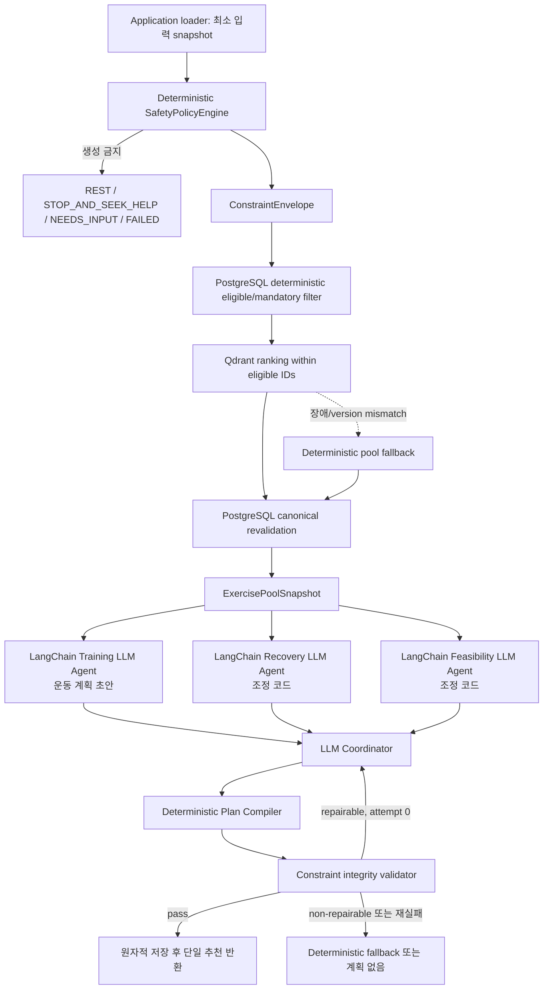
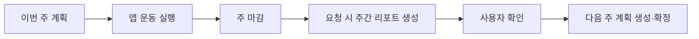

# ARCHITECTURE.md

## 1. 결정

### 1.1 최신 정책 정합화 기준 (2026-09-01)

`SERVICE_POLICY_SAFETY_AND_ADAPTATION_V1.md`의 결정 흐름을 제품 정책 기준으로 사용한다. 파이프라인은 `Safety Engine → Safety-approved Pool → Training/Recovery/Feasibility → Coordinator → Plan Compiler → Deterministic Integrity Validator`다. Training만 운동 계획을 제안하며 Recovery와 Feasibility는 adjustment code만 반환한다. 최종 validator는 compiled plan에서 Safety envelope, 장소, Recovery/Pain cap, 카탈로그·시간 버전을 재검증한다.

온보딩 eligibility, NRS 통증·Red Flag, Recovery, 실행 상태·타이머, calorie provenance는 API route가 아닌 domain/service와 repository 경계에 둔다. 운동 중 Safety Event는 세부 증상을 수집하지 않는 세션 종료 명령이며 공식 완료 상태와 분리 저장한다. 이전 V1/V2 경로는 호환 read 전용으로 유지하되 신규 write가 이 경계를 우회하면 안 된다.

초기 시스템은 React Native 모바일 앱, FastAPI 모듈형 모놀리스, PostgreSQL로 구성한다. 멀티에이전트는 별도 서비스가 아니라 백엔드 도메인 내부의 독립된 결정 모듈로 구현한다.

현행 구현은 SafetyPolicyEngine이 먼저 `ConstraintEnvelope`와 Safety-approved Pool을 고정하고, Training·Recovery·Feasibility 세 proposal 및 Coordinator가 그 경계 안에서 계획을 조립하는 방식이다. 컴파일 후 integrity validator는 별도의 Safety 판단을 만들지 않되, compiled plan이 envelope와 시간·카탈로그 제약을 지키는지 반드시 검증한다.

ADR-0012는 이 활성 흐름 사이에 결정적 conflict detection과 최대 한 번의 구조화 review를 넣는
V2 목표를 채택했으나, 2026-08-28 ADR-0015로 `SUPERSEDED`가 됐다. 해당 흐름은 production 경로로
구현된 적이 없고 V3에서도 제거된다. 아래 4.1절은 당시 목표 기록으로 보존한다.

ADR-0013은 Safety를 결정적 정책 엔진으로 선행하고 Training·Recovery·Feasibility와 Coordinator를
LLM Agent로 전환하며 LangChain·LangGraph를 도입하는 V3 목표 계약으로 `ACCEPTED`되었다. 구현·비교
검증과 production 전환 승인 전에는 아래 V1/V2 production 기준을 대체하지 않는다. `ACCEPTED`
ADR-0014는 ExercisePool의 Qdrant retrieval 세부 목표 계약을 추가한다.



이유:

- 4명 팀이 한 배포 단위에서 명확한 모듈 경계를 유지할 수 있다.
- 하나의 결정이 사용자, 루틴, 안전 규칙, 후보, 제안, 선택을 일관되게 저장해야 한다.
- 안전과 재현성을 네트워크 경계보다 코드·데이터 계약으로 강제하기 쉽다.
- 웨어러블·캘린더·LLM 장애가 수동 체크인을 포함한 핵심 흐름에 영향을 주지 않는다.

대안은 에이전트별 마이크로서비스와 워크플로 프레임워크다. 독립 배포·대규모 병렬 처리가 필요해질 때 재검토할 수 있으나, MVP에서는 운영 복잡성과 분산 트랜잭션 비용 때문에 선택하지 않는다.

## 2. 실행 및 배포 단위

핵심 MVP의 실행 단위는 다음 둘뿐이다.

1. 모바일 앱
2. FastAPI API 프로세스와 PostgreSQL

주간은 사용자 timezone 기준 월요일 00:00부터 일요일 23:59까지다. 주 마감은 날짜로 논리 계산하고, 주간 리포트는 사용자가 요청할 때 동기 생성한다. 따라서 초기에는 Redis, Celery, scheduler, Kafka가 필요하지 않다.

알림, 대량 집계, 외부 동기화가 실제 MVP 범위에 들어오고 동기 요청으로 처리할 수 없을 때만 worker와 queue를 별도 ADR로 검토한다.

## 3. 백엔드 모듈 경계

| 모듈 | 책임 | 의존 가능 대상 | 금지 |
|---|---|---|---|
| `identity` | Firebase 토큰 검증, 내부 사용자·외부 identity 연결, 삭제 차단 | integrations, repositories | 운동 규칙 판단 |
| `profiles` | 온보딩과 사용자 선호 | repositories, catalog lookup | 안전 임계값 판단 |
| `catalog` | 검수 운동·대체·FITT·출처 조회 | repositories | 미검수 콘텐츠 추천 |
| `routines` | 기본·주간 루틴과 버전 | catalog, policies | API에서 직접 생성 규칙 수행 |
| `checkins` | 당일 컨텍스트와 불편 입력 | repositories | 진단 또는 상태 추정 |
| `decisions` | 요청 스냅샷, 후보, 제안, 조정, 최종 결과 | rules, agents, catalog | 자유 형식 운동 생성 |
| `workouts` | 0초 경과 타이머 기록, 운동 블록 체크, 완료·부분·미수행·안전 중단 | decisions, repositories | 시간이나 웨어러블로 공식 완료 확정 |
| `weekly_reports` | 닫힌 주의 집계, 리포트 생성·확인, 다음 계획 게이트 | workouts, routines | 열린 주를 최종 리포트로 확정 |
| `integrations` | Firebase, 소셜 OAuth 교환, 웨어러블 어댑터, 선택적 LLM | 외부 SDK/API | 도메인 결정 소유 |

모듈 간 호출은 공개 service/port를 통하고, 다른 모듈의 repository나 ORM model을 직접 조작하지 않는다.

## 4. 결정 파이프라인

### 4.0 기본 루틴과 당일 결정의 관계

두 개념 모두 "루틴"으로 불려 혼동이 잦으므로 경계를 고정한다.

**기본 루틴(base routine)** 은 사용자의 주간 운동 계획표다. 하루짜리가 아니라 주 N일치 `routine_days`를
순환 구조로 갖는다. 온보딩 트랜잭션에서 최초 1회 provisioning되고, 이후에는 주간 리포트 확인 뒤의
주간 계획 revision이 새 version을 만든다. 다음을 고정한다.

- 오늘이 며칠째 칸인지: `(local_date - effective_from) % len(routine_days)`
- 그 칸의 `training_type_code`, `body_focus_code`, 운동 구성과 phase·tier
- `goal_code`와 `catalog_version`

**당일 결정(decision)** 은 기본 루틴의 오늘 칸을 그날의 check-in에 맞게 조정한 결과다. 기본 루틴의
오늘 칸이 `KEEP` 후보로 파이프라인에 들어가며, 통증·피로·시간·장소 제약이 없으면 그대로 최종 추천이
된다. 제약이 있으면 `DOWNSHIFT`, `RECOVERY`, `REST` 등으로 조정된다.

따라서 결정이 기본 루틴을 대체하는 것이 아니라 조정한다. `decision_runs.base_routine_id`는 non-null
이며 기본 루틴이 없으면 결정을 생성할 수 없다.

기본 루틴은 사용자에게 노출하지 않는다. 최종 추천 루틴 하나만 보여주는 제품 불변식을 지키기 위해서다.
사용자 문구에도 `기본 루틴` 같은 내부 용어를 쓰지 않고 `운동 계획`으로 표현한다.



현행 목표에서는 Training·Recovery·Feasibility 세 proposal을 병렬 실행한다. SafetyPolicyEngine의 생성 금지·veto는 Coordinator 이전에 결정되며, 최종 validator가 compiled plan의 envelope 위반을 거부한다. 필수 Agent 또는 provider 실패는 검증 가능한 결정적 fallback으로만 진행하고, 안전한 fallback이 없으면 계획 없이 실패한다.

### 4.1 (SUPERSEDED) V2 목표 — bounded structured deliberation

> ADR-0015(2026-08-28)로 대체됐다. 이 절의 conflict detector와 Round 2 review는 현행 계약이 아니다.
> 결정 기록으로만 보존한다.

ADR-0012에 따라 다음 목표 흐름을 A2의 framework-independent domain core로 먼저 검증한다.



- Round 1 누락·`FAILED`·`NEEDS_INPUT`은 Round 2로 진행하지 않는다.
- conflict가 있을 때만 영향받는 Agent를 한 번 review한다. 비대상 Agent와 no-conflict의 네 Agent는
  Agent 호출 없는 `NOT_REQUIRED` event로 기록해 누락과 생략을 구분한다.
- review는 다른 proposal의 machine code·hash·constraint만 읽고 자유 텍스트 토론을 하지 않는다.
- Safety veto·제외는 완화할 수 없고 요청 시간·승인 후보·버전은 Round 2에서 바꿀 수 없다.
- 미해결 충돌에서 모든 hard constraint를 만족하는 후보가 없으면 계획을 반환하지 않는다.
- integrity validator는 기존 Safety 의견 보존을 검사할 뿐 독립적인 FinalSafetyGate가 아니다.

### 4.2 승인된 V3 목표 — Safety-first LLM Agent orchestration



- LangGraph는 위 node·conditional edge·fan-out/fan-in과 bounded repair를 orchestration한다.
- LangChain은 세 전문 Agent와 Coordinator의 provider adapter, prompt, Pydantic structured output을
  담당한다.
- SafetyPolicyEngine, constraint builder, compiler와 validator는 framework와 provider에 독립적인
  Python/Pydantic domain core다.
- ADR-0015에 따라 Training만 운동 계획을 만든다. Recovery와 Feasibility는 조정 코드로 관점을
  제공하며 이는 Coordinator에 대한 권고이지 결정론적 강제가 아니다. 안전은 `ConstraintEnvelope`와
  integrity validator가 강제하므로 두 Agent의 응답 여부가 안전 판정을 바꾸지 않는다.
- Coordinator 출력에 대한 결정론적 검사는 integrity validator 하나다. 상류에 중복 관문을 두지
  않는다. 검사 대상이 proposal이 아니라 컴파일된 계획이므로 Coordinator가 무엇을 하든 사용자에게
  나가는 산출물이 envelope를 벗어날 수 없다.
- application loader가 PostgreSQL에서 승인된 eligible/mandatory 운동 ID를 결정적으로 먼저 계산한다.
  ADR-0014에 따라 별도 Qdrant derived index는 eligible 범위 안의 순위·다양성만 정하고, 결과를 같은
  catalog version의 PostgreSQL에서 다시 조회·검증한 뒤 canonical `ExercisePoolSnapshot`을 고정한다.
- 필수 목표 운동과 승인 안전 대체는 Vector 결과와 무관하게 보존한다. Qdrant 장애·stale/version
  mismatch는 결정적 pool fallback으로 처리하며 Safety 결과를 바꾸지 않는다.
- Agent와 Coordinator는 DB·repository·ORM·raw SQL·Qdrant Tool을 갖지 않는다.
- 최종 validator는 안전 규칙을 다시 해석하지 않고 실제 compiled plan이 확정 envelope를 준수하는지만
  검사한다.
- persistent LangGraph checkpointer는 V3 첫 구현에 포함하지 않는다. PostgreSQL decision record가
  canonical source of truth다.

V3 domain/runtime/persistence 기반과 regeneration API boundary는 단계적으로 구현 중이지만 production
application wiring은 아직 비활성이다. V1/V2 historical 실행과 response를 보존하고 전체 구현·검증 후
별도 production 전환 승인으로 새 `graph_version`에서만 활성화한다.

## 5. 에이전트 책임

- `SafetyPolicyEngine`: 통증·Red Flag·카탈로그 검수·장소를 결정적으로 해석해 생성 허용 여부, 제외 후보와 ceiling을 고정한다.
- `TrainingAgent`: 승인 pool 안에서 주간 FITT·목표 태그를 반영한 PlanSpec 초안만 제안한다.
- `RecoveryAgent`: 피로·수면·복귀 상한에 대한 `adjustment_codes`만 제안한다.
- `FeasibilityAgent`: 장소·시간·실행 가능성에 대한 `adjustment_codes`만 제안한다.
- `Coordinator`: 세 proposal을 종합해 하나의 PlanSpec을 선택하지만 envelope를 완화하거나 DB·Qdrant를 직접 조회할 수 없다.

V3 목표에서는 Safety를 Agent 목록에서 제거하고 결정적 `SafetyPolicyEngine`으로 승격한다.
Training은 승인 운동 pool 안에서 PlanSpec 초안을 만들고, Recovery와 Feasibility는 회복 상한과 실행
가능성 proposal을 만들며, LLM Coordinator는 이를 종합·선택한다. Coordinator는 DB를 조회하거나
새 안전 기준을 만들지 않는다.

Coordinator는 운동 계획을 반환하는 경우 계획 구성요소의 합계인 `estimated_duration_seconds`를 `requested_duration_minutes * 60`과 ±300초(5분) 이내로 맞춘다. 허용 범위 안의 후보 중 차이가 가장 작은 계획을 선택하며, 차이가 같으면 더 긴 계획을 우선한다. 이 허용 범위는 2026-08-27 프로젝트 오너 승인이며 V1/V2 루틴 경로와 V3 계획 경로가 같은 상수(`DURATION_TOLERANCE_SECONDS`)를 공유한다. 허용 범위를 만족하는 계획을 만들 수 없으면 시간을 임의로 축소·초과하지 않고 계획을 반환하지 않는다. `requested_duration_minutes` 자체는 서버가 변경하지 않는다. 이 값은 계획 단계의 hard target이며 실제 경과 시간이나 완료 판정의 기준은 아니다.

조정기는 운동을 자유 생성하거나 안전 veto를 해제하지 않는다. LLM은 reason code를 설명 문장으로 바꾸는 선택 기능일 뿐이다.

공개 요약은 SafetyPolicyEngine 결과와 세 proposal·Coordinator의 제한된 결과만 보여주며 내부 추론을 포함하지 않는다.

V2 목표에서 각 Agent는 Round 1 hard constraint와 preference를 분리하고, Round 2에서는 영향받은
preference만 수정한다. Safety veto·제외, Feasibility 불가능 조건, 승인된 Recovery ceiling과
요청 시간은 다른 Agent의 선호로 완화할 수 없다. Training 목표까지 동시에 보존할 승인 후보가
없으면 목표를 임의 교체하지 않고 계획 없는 기존 상태로 종료한다.

## 6. 안전 상태와 최종 액션

안전 평가와 사용자용 운동 액션을 분리한다.

| SafetyStatus | 의미 | 계획 |
|---|---|---|
| `PASS` | 안전 규칙 통과 | 허용 |
| `NEEDS_INPUT` | 필수 안전 입력 부족 | 없음 |
| `REVISE` | 충돌 후보 제거·대체 필요 | Coordinator가 수정 후보에 반영 |
| `BLOCKED` | 현재 입력으로 운동 제공 불가 | 없음 |
| `FAILED` | 필수 규칙·에이전트·저장 실패 | 없음 |

최종 액션은 `KEEP`, `DOWNSHIFT`, `CHANGE`, `RECOVERY`, `REST`, `STOP_AND_SEEK_HELP`다. 심한 국소 불편·급성 근골격 신호의 `BLOCKED`는 `REST`, 중대한 이상 반응의 `BLOCKED`는 `STOP_AND_SEEK_HELP`로 표현한다.

## 7. 인증 경계

클라이언트가 사용하는 최종 세션 권한은 Firebase ID Token이다.

- 첫 구현 provider: ADR-0009 승인 뒤 Kakao authorization-code/OIDC adapter를 독립 PR로 추가하고
  Firebase custom token으로 교환한다.
- Google: 기존 Firebase 기본 provider 경로만 사용하며 backend 직접 OAuth adapter를 중복 구현하지 않는다.
- Naver: Kakao 수직 슬라이스 안정화, 공개 서비스 검수와 token 영구 저장 없는 해제 계약 승인 뒤 추가한다.
- FastAPI: Firebase ID Token만 최종 권한으로 검증한다.
- DB: 기존 `user_identities`에 additive `identity-social-v1` KAKAO row를 추가한다. Firebase
  principal 분리는 실제 명시적 다중-provider 연결 요구가 생길 때 별도 설계한다.

provider subject 검증은 signature, issuer, audience, expiry, subject와 지원 provider의 nonce를
확인한 뒤 최소 `(provider_code, provider_subject)`만 반환한다. 이메일 링크와 Apple 로그인은 MVP
이후 후보다. 공급자 token, 이메일, 전체 이름, 닉네임, 전화번호와 원시 provider 응답은 운동
도메인 DB와 로그에 저장하지 않는다. 상세 계약과 공식 문서 근거는 `PROPOSED` ADR-0009와
`auth-provider-policy-v1`을 따른다.

## 8. 주간 폐쇄 루프



공식 수행 상태는 운동 블록의 사용자 완료 체크로 `COMPLETED`, `PARTIAL`, `NOT_COMPLETED` 중 하나가 된다. `STOPPED_SAFETY`는 별도 실행 상태와 Safety Event이며, 0초부터 증가하는 경과 타이머·웨어러블·외부 운동은 공식 완료를 확정하지 않는다.

## 9. 운동 실행 화면 경계

```text
┌──────────────────────────────┐
│ 00:00부터 증가하는 경과 타이머 │
├──────────────────────────────┤
│ 현재 운동 마스코트 애니메이션  │
├──────────────────────────────┤
│ 운동 블록 1  [자세·설명 펼침]  │
│ 운동 블록 2  [자세·설명 펼침]  │
│ 운동 블록 3  [자세·설명 펼침]  │
└──────────────────────────────┘
```

- 서버는 운동 유형, 상·하체 등 초점, 운동 순서, 세트·반복·권장 목표, 검수 설명을 제공한다.
- 클라이언트는 상단 경과 타이머, 중앙 마스코트, 하단 블록과 체크·격파·좌측 밀기 제스처를 표현한다.
- 모든 제스처는 동일한 plan item 완료 API로 귀결된다.
- 경과 시간은 정보값이며 블록이나 세션을 자동 완료하지 않는다.
- 다음 운동은 서버의 sequence 중 첫 PENDING 블록이다.

## 10. 데이터와 트랜잭션 경계

- PostgreSQL이 단일 진실 공급원이다.
- decision run, SafetyPolicyEngine 결과, 세 proposal, 후보, Coordinator 결정 결과를 분리 저장한다.
- V2 목표의 conflict/review 저장은 ADR-0015로 폐기됐다. `decision_deliberations`,
  `agent_review_events`, `agent_proposal_revisions`는 쓰기를 중단하되 같은 릴리스에서 삭제하지
  않는다(AGENTS.md 10절).
- V3 목표는 ConstraintEnvelope, ExercisePoolSnapshot, 세 LLM proposal, model/prompt/output schema
  version, Coordinator initial/repair attempt, compiler/validator 결과와 regeneration lineage를
  분리 저장한다.
- ADR-0014에 따라 V3 목표는 catalog, collection, vector index, embedding model, query, retrieval
  request/result와 deterministic fallback version을 PostgreSQL에 함께 저장한다. Qdrant는 canonical
  decision 기록이 아니다.
- LangGraph runtime state나 checkpoint를 canonical decision 기록으로 사용하지 않는다.
- 성공 응답 전에 해당 결정 기록이 원자적으로 저장돼야 한다.
- 주간 리포트는 닫힌 주의 불변 집계 스냅샷과 생성 정책 버전을 저장한다.
- 주간 리포트는 패턴 요약, 조정 방향, 다음 행동과 잠정 agent summary를 함께 저장한다.
- 체중 기반 예상 소모 칼로리는 참고 정보로 저장하며 진단·안전 판정의 단독 근거로 사용하지 않는다.
- `user_consents`는 일반·민감·웨어러블·마케팅 네 개인정보 consent의 현재 상태를 저장하고, `user_consent_events`는 동의·철회 append-only 이력을 저장한다. `user_terms_agreements`는 서비스 이용약관의 `terms_version`·`terms_agreed_at` 이력을 별도로 저장한다. 개인정보처리방침은 별도 동의 상태 없이 열람만 제공한다.
- JSONB는 입력 스냅샷·proposal·확장 메타데이터에만 사용한다.
- 계정 삭제 요청 즉시 접근을 막고 운영 DB 사용자 연결 데이터는 7일 이내, 백업은 30일 이내 만료한다.

## 11. 오류와 폴백

| 실패 | 동작 |
|---|---|
| 선택 입력 누락 | unknown 유지, 추론 금지 |
| 필수 안전 입력 누락 | `NEEDS_INPUT`, 필요한 필드만 반환 |
| 필수 규칙·전문 에이전트 실패 | `FAILED`, 계획 없음 |
| 안전 후보 없음 | `BLOCKED` + `REST` |
| DB 저장 실패 | 성공 응답 금지 |
| LLM 실패 | 같은 결정과 검수 템플릿 |
| 웨어러블 없음 | 수동 체크인 정상 흐름 |
| 중복 mutation | 저장된 멱등 응답 반환 |

V3에서는 필수 LLM Agent나 provider 실패 시 부분 proposal로 Coordinator를 실행하지 않는다. 동일한
envelope를 만족하는 결정적 fallback을 compiler·validator로 검증해 반환하고, 안전한 fallback이 없으면
원인별 계획 없는 상태로 종료한다. Coordinator repair는 repairable violation에 한 번만 허용한다.

### V3-C1 private shadow composition

V3-C1은 FastAPI `create_app()`이나 production decision service에 연결하지 않는 별도 composition
root다. `Settings → OpenAI BaseChatModel factory → StructuredChatInvoker → 세 Specialist/Coordinator
adapter → stateless V3LangGraphRuntime` 순서로만 조립하며 immutable synthetic
`ConstraintEnvelope`와 `ExercisePoolSnapshot`을 입력으로 받는다. SQLAlchemy, repository, Qdrant와
사용자 식별자는 이 dependency graph에 존재하지 않는다.

provider 호출은 public regeneration gate와 독립적인 `V3_SHADOW_EVALUATION_ENABLED` 및 모든 V3/LLM
server gate, 승인 model allowlist, 실행 도구의 명시적 provider-call opt-in을 모두 요구한다. 결과는
schema-versioned identifier-free JSONL로 `outputs/v3-shadow/**` 아래에만 기록한다. graph의 additive
audit result는 세 proposal, Coordinator initial/repair, compilation, validation, fallback과
invocation metric을 보존하지만 raw prompt/response와 provider exception은 보존하지 않는다.
이 경로는 synthetic/offline·staging 평가 전용이며 public V1/V2 응답을 변경하지 않는다.

## 12. 로컬 및 MVP 배포

로컬 목표 구성은 mobile app, API, PostgreSQL이다. 실행 가능한 Compose 파일은 기반 구현 단계에서 API와 환경 변수가 확정된 뒤 추가한다.

MVP 배포는 관리형 PostgreSQL 하나와 컨테이너 또는 단일 애플리케이션 런타임의 FastAPI 하나, 모바일 빌드 배포로 시작한다. 특정 클라우드 공급자는 아직 고정하지 않는다. Kubernetes, 별도 agent service, Redis, object storage는 기본 구성에 포함하지 않는다.

## 13. 선택하지 않은 대안

- 에이전트 마이크로서비스: 작은 팀에서 배포·인증·추적 비용이 크다.
- V1/V2의 LangGraph 기본 도입: 현재 production 흐름에는 필요하지 않다. ADR-0013 V3는 병렬
  fan-out/fan-in, bounded repair와 regeneration 재진입 때문에 LangGraph runtime을 제안하되
  persistent checkpointer는 별도 승인 전까지 사용하지 않는다.
- Redis/Celery/scheduler: 요청 시 리포트와 동기 결정에 필요하지 않다.
- 벡터 DB/RAG: 검수된 정규화 카탈로그 조회 문제에 맞지 않는다.
- 이벤트 소싱: 감사 요구를 충족하는 명시적 기록 테이블보다 복잡하다.
- LLM 후보 생성: 안전·재현성 계약을 약화한다.

## 14. 아직 확정되지 않은 사항

- 배포 클라우드, 리전, 비용 상한
- LLM 설명 기능의 실제 MVP 활성화 여부와 비용 상한. 공급자와 경계는 ADR-0011에서 OpenAI adapter로
  고정했고 기본값은 비활성이다.
- ADR-0012 V2의 기준 구현 비교 결과와 LangGraph 채택 여부
- ADR-0013 V3의 필수 승인, production model·비용·latency 기준과 snapshot freshness TTL
- 소셜 OAuth provider별 앱 심사 일정과 Firebase custom token 운영 방식
- 수면·부하·복귀 볼륨의 외부 검수된 수치
- 외부 도메인 검수자와 승인 증적 형식
- 운동 완료 제스처를 체크 버튼, 격파, 좌측 밀기 중 어떤 조합으로 제공할지

## 15. 팀 확인 질문

- Google/Kakao/Naver 앱 등록과 비밀값을 누가 소유하는가?
- 첫 파일럿의 사용자 timezone은 다지역을 지원하는가, 한국 시간만 허용하는가?
- 주간 리포트 명시적 확인 버튼의 최종 문구와 배치는 무엇인가?
- 배포 환경은 데모 1개인지 staging과 production을 분리할지?
