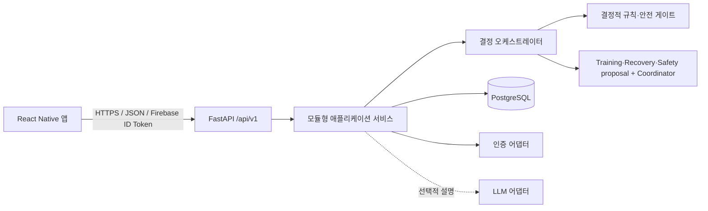
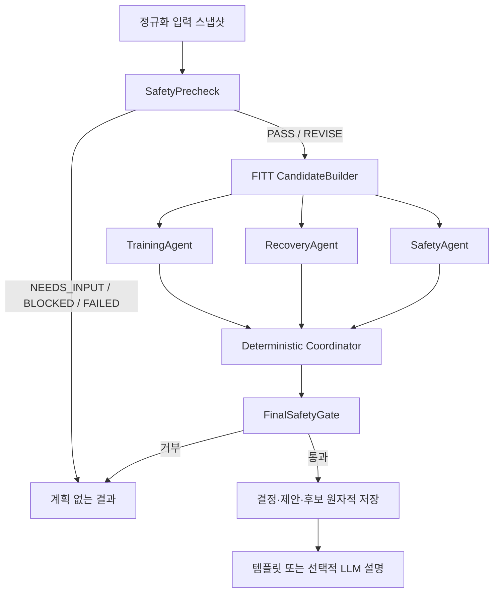
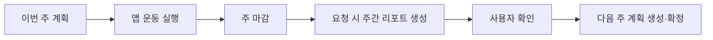

# ARCHITECTURE.md

## 1. 결정

초기 시스템은 React Native 모바일 앱, FastAPI 모듈형 모놀리스, PostgreSQL로 구성한다. 멀티에이전트는 별도 서비스가 아니라 백엔드 도메인 내부의 독립된 결정 모듈로 구현한다.

멀티 에이전트 로직은 설계 전 단계다. 에이전트 내부 흐름과 공개 요약의 상세 계약은 설계 후 확정하며, 현재 문서의 모듈 경계와 버전 필드는 잠정이다. 안전 게이트와 실패 안전 경계는 현재 확정한다.



이유:

- 4명 팀이 한 배포 단위에서 명확한 모듈 경계를 유지할 수 있다.
- 하나의 결정이 사용자, 루틴, 안전 규칙, 후보, 제안, 선택을 일관되게 저장해야 한다.
- 안전과 재현성을 네트워크 경계보다 코드·데이터 계약으로 강제하기 쉽다.
- 웨어러블·캘린더·LLM 장애가 수동 입력을 포함한 핵심 흐름에 영향을 주지 않는다.

대안은 에이전트별 마이크로서비스와 워크플로 프레임워크다. 독립 배포·대규모 병렬 처리가 필요해질 때 재검토할 수 있으나, MVP에서는 운영 복잡성과 분산 트랜잭션 비용 때문에 선택하지 않는다.

## 2. 실행 및 배포 단위

핵심 MVP의 실행 단위는 다음 둘뿐이다.

1. 모바일 앱
2. FastAPI API 프로세스와 PostgreSQL

주간은 사용자 timezone 기준 월요일 00:00부터 일요일 23:59까지다. 주 마감은 날짜로 논리 계산하고, 주간 리포트는 사용자가 요청할 때 동기 생성한다. 따라서 초기에는 Redis, Celery, scheduler, Kafka가 필요하지 않다.

알림, 대량 집계, 외부 동기화가 실제 MVP 범위에 들어오고 동기 요청으로 처리할 수 없을 때만 worker와 queue를 별도 ADR로 검토한다.

## 3. 백엔드 모듈 경계

| 모듈 | 책임 | 의존 가능 대상 | 금지 |
|---|---|---|---|
| `identity` | Firebase 토큰 검증, 내부 사용자·외부 identity 연결, 삭제 차단 | integrations, repositories | 운동 규칙 판단 |
| `profiles` | 온보딩과 사용자 선호 | repositories, catalog lookup | 안전 임계값 판단 |
| `catalog` | 검수 운동·대체·FITT·출처 조회 | repositories | 미검수 콘텐츠 추천 |
| `routines` | 기본·주간 루틴과 버전 | catalog, policies | API에서 직접 생성 규칙 수행 |
| `checkins` | 당일 컨텍스트와 불편 입력 | repositories | 진단 또는 상태 추정 |
| `decisions` | 요청 스냅샷, 후보, 제안, 조정, 최종 결과 | rules, agents, catalog | 자유 형식 운동 생성 |
| `workouts` | 0초 경과 타이머 기록, 운동 블록 체크, 완료·부분·미수행·안전 중단 | decisions, repositories | 시간이나 웨어러블로 공식 완료 확정 |
| `weekly_reports` | 닫힌 주의 집계, 리포트 생성·확인, 다음 계획 게이트 | workouts, routines | 열린 주를 최종 리포트로 확정 |
| `integrations` | Firebase, 소셜 OAuth 교환, 웨어러블·캘린더 어댑터, 선택적 LLM | 외부 SDK/API | 도메인 결정 소유 |

모듈 간 호출은 공개 service/port를 통하고, 다른 모듈의 repository나 ORM model을 직접 조작하지 않는다.

## 4. 결정 파이프라인



전문 proposal 에이전트는 MVP에서 순차 실행한다. 세 proposal 중 하나라도 필수 proposal을 만들지 못하면 결정 실행은 `FAILED`이며 운동 계획을 성공 응답하지 않는다. Coordinator는 proposal을 생성하지 않고 취합·선택을 담당한다.

## 5. 에이전트 책임

- `TrainingAgent`: 주간 FITT와 목표 태그, CORE 보존 제약을 제안한다.
- `RecoveryAgent`: 피로·수면·최근 부하·불편·복귀 상한을 제안한다.
- `SafetyAgent`: 결정적 안전 규칙과 충돌 운동 제외에 필요한 구조화 판단을 제안한다. 최종 안전 권한은 FinalSafetyGate가 갖는다.
- `Coordinator`: 세 proposal과 검수된 후보를 취합해 최종 루틴 한 개를 선택한다. 안전 veto를 해제하거나 카탈로그 밖 운동을 만들 수 없다.

조정기는 운동을 자유 생성하거나 안전 veto를 해제하지 않는다. LLM은 reason code를 설명 문장으로 바꾸는 선택 기능일 뿐이다.

현재 멀티 에이전트 로직의 proposal·coordinator·회의 UI 상세는 설계 후 확정한다. 공개 요약은 내부 추론을 포함하지 않는다.

## 6. 안전 상태와 최종 액션

안전 평가와 사용자용 운동 액션을 분리한다.

| SafetyStatus | 의미 | 계획 |
|---|---|---|
| `PASS` | 안전 규칙 통과 | 허용 |
| `NEEDS_INPUT` | 필수 안전 입력 부족 | 없음 |
| `REVISE` | 충돌 후보 제거·대체 필요 | 재검증 후 허용 |
| `BLOCKED` | 현재 입력으로 운동 제공 불가 | 없음 |
| `FAILED` | 필수 규칙·에이전트·저장 실패 | 없음 |

최종 액션은 `KEEP`, `DOWNSHIFT`, `CHANGE`, `RECOVERY`, `REST`, `STOP_AND_SEEK_HELP`다. 심한 국소 불편·급성 근골격 신호의 `BLOCKED`는 `REST`, 중대한 이상 반응의 `BLOCKED`는 `STOP_AND_SEEK_HELP`로 표현한다.

## 7. 인증 경계

클라이언트가 사용하는 최종 세션 권한은 Firebase ID Token이다.

- Google: Firebase 기본 provider
- Kakao/Naver: provider OAuth 응답을 백엔드 adapter가 검증하고 Firebase custom token으로 교환
- FastAPI: Firebase ID Token만 검증
- DB: `users`와 provider-neutral `user_identities`를 분리

이메일 링크와 Apple 로그인은 MVP 이후 후보다. 공급자 token, 이메일, 전체 이름은 운동 도메인 DB와 로그에 저장하지 않는다.

## 8. 주간 폐쇄 루프



공식 수행 상태는 운동 블록의 사용자 완료 체크로 `COMPLETED`, `PARTIAL`, `NOT_COMPLETED`, `STOPPED_FOR_SAFETY` 중 하나가 된다. 0초부터 증가하는 경과 타이머, 웨어러블과 외부 운동은 참고 신호이며 공식 완료를 확정하지 않는다.

## 9. 운동 실행 화면 경계

```text
┌──────────────────────────────┐
│ 00:00부터 증가하는 경과 타이머 │
├──────────────────────────────┤
│ 현재 운동 마스코트 애니메이션  │
├──────────────────────────────┤
│ 운동 블록 1  [자세·설명 펼침]  │
│ 운동 블록 2  [자세·설명 펼침]  │
│ 운동 블록 3  [자세·설명 펼침]  │
└──────────────────────────────┘
```

- 서버는 운동 유형, 상·하체 등 초점, 운동 순서, 세트·반복·권장 목표, 검수 설명을 제공한다.
- 클라이언트는 상단 경과 타이머, 중앙 마스코트, 하단 블록과 체크·격파·좌측 밀기 제스처를 표현한다.
- 모든 제스처는 동일한 plan item 완료 API로 귀결된다.
- 경과 시간은 정보값이며 블록이나 세션을 자동 완료하지 않는다.
- 다음 운동은 서버의 sequence 중 첫 PENDING 블록이다.

## 10. 데이터와 트랜잭션 경계

- PostgreSQL이 단일 진실 공급원이다.
- decision run, 세 proposal, 후보, 안전 평가, 조정 결과를 분리 저장한다.
- 성공 응답 전에 해당 결정 기록이 원자적으로 저장돼야 한다.
- 주간 리포트는 닫힌 주의 불변 집계 스냅샷과 생성 정책 버전을 저장한다.
- 주간 리포트는 패턴 요약, 조정 방향, 다음 행동과 잠정 agent summary를 함께 저장한다.
- 체중 기반 예상 소모 칼로리는 참고 정보로 저장하며 진단·안전 판정의 단독 근거로 사용하지 않는다.
- 일반·민감·웨어러블·캘린더·마케팅 동의와 철회 이력을 분리 저장한다.
- JSONB는 입력 스냅샷·proposal·확장 메타데이터에만 사용한다.
- 계정 삭제 요청 즉시 접근을 막고 운영 DB 사용자 연결 데이터는 7일 이내, 백업은 30일 이내 만료한다.

## 11. 오류와 폴백

| 실패 | 동작 |
|---|---|
| 선택 입력 누락 | unknown 유지, 추론 금지 |
| 필수 안전 입력 누락 | `NEEDS_INPUT`, 필요한 필드만 반환 |
| 필수 규칙·전문 에이전트 실패 | `FAILED`, 계획 없음 |
| 안전 후보 없음 | `BLOCKED` + `REST` |
| DB 저장 실패 | 성공 응답 금지 |
| LLM 실패 | 같은 결정과 검수 템플릿 |
| 웨어러블 없음 | 수동 체크인 정상 흐름 |
| 중복 mutation | 저장된 멱등 응답 반환 |

## 12. 로컬 및 MVP 배포

로컬 목표 구성은 mobile app, API, PostgreSQL이다. 실행 가능한 Compose 파일은 기반 구현 단계에서 API와 환경 변수가 확정된 뒤 추가한다.

MVP 배포는 관리형 PostgreSQL 하나와 컨테이너 또는 단일 애플리케이션 런타임의 FastAPI 하나, 모바일 빌드 배포로 시작한다. 특정 클라우드 공급자는 아직 고정하지 않는다. Kubernetes, 별도 agent service, Redis, object storage는 기본 구성에 포함하지 않는다.

## 13. 선택하지 않은 대안

- 에이전트 마이크로서비스: 작은 팀에서 배포·인증·추적 비용이 크다.
- LangGraph 기본 도입: 현재 흐름은 결정적 순차 파이프라인으로 충분하다.
- Redis/Celery/scheduler: 요청 시 리포트와 동기 결정에 필요하지 않다.
- 벡터 DB/RAG: 검수된 정규화 카탈로그 조회 문제에 맞지 않는다.
- 이벤트 소싱: 감사 요구를 충족하는 명시적 기록 테이블보다 복잡하다.
- LLM 후보 생성: 안전·재현성 계약을 약화한다.

## 14. 아직 확정되지 않은 사항

- 배포 클라우드, 리전, 비용 상한
- LLM 공급자와 LLM 설명 기능의 실제 MVP 포함 여부
- 소셜 OAuth provider별 앱 심사 일정과 Firebase custom token 운영 방식
- 수면·부하·복귀 볼륨의 외부 검수된 수치
- 외부 도메인 검수자와 승인 증적 형식
- 요청 시간과 예상 시간의 허용 편차·표시 문구
- 운동 완료 제스처를 체크 버튼, 격파, 좌측 밀기 중 어떤 조합으로 제공할지

## 15. 팀 확인 질문

- Google/Kakao/Naver 앱 등록과 비밀값을 누가 소유하는가?
- 첫 파일럿의 사용자 timezone은 다지역을 지원하는가, 한국 시간만 허용하는가?
- 주간 리포트 명시적 확인 버튼의 최종 문구와 배치는 무엇인가?
- 배포 환경은 데모 1개인지 staging과 production을 분리할지?
