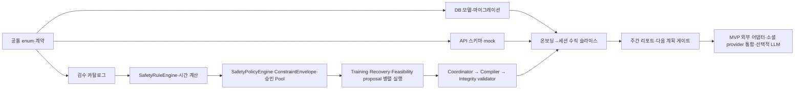

# IMPLEMENTATION_PLAN.md

## 1. 목표

프론트엔드 1명, 백엔드 1명, 개발팀장·백엔드/데이터 1명, PM 1명이 계약을 먼저 고정하고 병렬 개발해 첫 수직 슬라이스부터 전체 흐름을 통합한다.

## 2. 구현 전 게이트

다음 항목이 승인되기 전에는 해당 구현을 시작하지 않는다.

- 머신 코드: 목표, 경험, 장소, 장비, 운동 유형, 미수행 이유
- 안전 데이터: 부위별 충돌, 대체 관계, 회복 콘텐츠, 검수 증적
- API: 온보딩, 체크인, decision, session, weekly report 스키마
- DB: 사용자 identity, 결정 기록, 주간 리포트 관계
- 외부 설정: Firebase project와 Google/Kakao/Naver 앱 소유자

건강·안전 수치가 미확정이어도 구조와 인터페이스 구현은 가능하지만 임의 기본값으로 동작시키지 않는다.

## 3. 선행 관계

## 4. 단계별 계획

### 단계 0 — 계약 동결

- 현재 설계 문서 팀 리뷰
- P0 결정의 추적성 행 확정
- 첫 수직 슬라이스 API 예제 승인
- SafetyPolicyEngine·ConstraintEnvelope·세 proposal·Coordinator·compiler·validator의 입력·출력, 버전·실패 계약 확정
- 기존 클라이언트의 `adult_confirmed`·`age_band_code` 처리 방식을 구현 전에 확정한다. deprecation 기간 동안 구필드를 무시하고 서버 계산값을 사용하는 방식 또는 별도 API 버전 전략을 선택하고, 선택한 전략의 프론트엔드·백엔드 호환성 테스트를 완료한다.
- 안전 미확정 항목을 owner와 due date가 있는 작업으로 분리

완료 기준: 공개 enum과 필드의 변경 요청이 PR로 관리된다.

### 단계 1 — 기반

- frontend/backend 프로젝트 초기화
- FastAPI health, 공통 오류, 설정, 로깅
- PostgreSQL 연결과 첫 Alembic baseline
- Firebase ID Token 검증 adapter
- OpenAPI 타입 생성 흐름

이 단계부터 패키지와 실행 설정을 추가한다. 본 설계 작업에는 포함하지 않는다.

### 단계 2 — 결정적 핵심

- 정규화 운동 seed와 검수 상태
- 시간 계산기
- 공통 입력 스냅샷과 기본 후보
- 결정적 Safety 규칙과 시간 계산
- 단계 0에서 승인된 SafetyPolicyEngine과 Training·Recovery·Feasibility proposal 병렬 실행
- 단계 0에서 승인된 Coordinator·compiler·integrity validator
- 재현 기록 저장

### 단계 3 — 첫 수직 슬라이스

범위:

1. 테스트 로그인, 생년월일(`YYYY-MM-DD`) 입력, 사용자 timezone의 로컬 날짜 기준 서버 만 18–64세 eligibility 판정, 생년월일 암호화 저장, API 응답·에이전트·decision 입력에는 생년월일과 만 나이를 전달하지 않음
2. 홈·맨몸·상체 목표 온보딩
3. 검수된 40분 기본 루틴
4. 피로 MODERATE, 통증 없음, 희망 시간 40분 확인
5. 증상 사용자 입력에서 SafetyPolicyEngine의 envelope·제외 운동과 세 proposal을 함께 확인
6. Coordinator·compiler·validator가 요청 시간 40분으로 결정·검증한 최종 루틴
7. 최종 루틴 선택, 상단 0초 경과 타이머 시작
8. 중앙 마스코트와 하단 순서형 운동 블록 표시
9. 운동 블록별 사용자 완료 체크와 다음 블록 이동
10. 모든 블록 체크로 `COMPLETED` 저장과 피드백

완료 기준:

- React Native → FastAPI → PostgreSQL 실제 연결
- LLM 없이 실행하고, 웨어러블 미연동·권한 거부 시 수동 체크인으로 실행
- 동일 입력·버전에서 동일 결정
- 준비·휴식·전환·마무리를 포함한 예상 시간을 요청 시간과 ±300초 이내로 맞춤
- 사용자 동의 없이 requested duration을 변경하지 않음
- 경과 시간과 무관하게 운동 블록 체크로 상태 계산
- proposal과 최종 결과 분리 저장

### 단계 4 — 안전·실행 상태

- 무릎 MILD/MODERATE 대체 시나리오
- SEVERE REST, 중대한 이상 반응 STOP
- 완료 블록 기반 `PARTIAL`, `NOT_COMPLETED`와 별도 `STOPPED_SAFETY` 실행 상태·Safety Event
- 미수행 이유 학습 신호와 마지막 공식 완료 후 14일 복귀 모드
- 오프라인 임시 진행 상태와 중복 요청 복구

### 단계 5 — 주간 폐쇄 루프

- 월–일 주 경계
- 닫힌 주 집계
- 요청 시 리포트 생성
- 리포트 확인 전 다음 주 계획 확정 차단
- AI 수정 최대 2회와 이후 직접 편집
- 직접 편집 결과 요청 시간·장소 제약과 저장된 Safety envelope·integrity validation 준수 확인

### 단계 6 — MVP 외부 연동·안정화와 후속 기능 분리

- MVP 필수 Google/Kakao/Naver provider의 실제 앱 설정·통합 검증
- 선택적 LLM 설명과 템플릿 폴백
- 성능·보안·삭제 리허설
- MVP에서 선택한 웨어러블 어댑터 통합 검증
- 체중 기반 예상 소모 칼로리 추정치와 비의료적 안내 검증
- 승인된 proposal·Coordinator 계약을 기준으로 공개 회의 UI 표시 세부사항 확정 및 회귀 테스트 갱신
- MVP에서 선택한 provider 외 추가 웨어러블 provider는 후속 기능으로 분리

## 5. 병렬 작업 스트림

| 스트림 | 담당 | 계약 입력 | 첫 산출물 |
|---|---|---|---|
| 모바일 | 프론트엔드 | API examples, 상태 enum | 온보딩·체크인·결정 mock 화면 |
| API/DB | 백엔드 | API/DATA_MODEL | auth, profile, routine, session 기반 |
| 규칙/데이터 | 개발팀장·백엔드/데이터 | DOMAIN_RULES, catalog schema | seed, 시간 계산, safety golden tests |
| 제품/검수 | PM | MVP, traceability | 인수 조건, 문구·출처·외부 검수 |

통합은 스키마 mock → OpenAPI 호환성 → 실제 DB 순서로 진행한다.

## 6. PR 분할 권장안

1. repository/tooling scaffold
2. common enums and error contract
3. auth and onboarding
4. catalog normalization and approved seed
5. safety/time rule engine
6. routine and common base candidate
7. agent proposals and coordinator
8. decision API and persistence
9. mobile decision flow
10. workout execution and feedback
11. weekly report gate

각 PR은 한 명의 primary owner를 갖고, API·DB·안전 계약이 바뀌면 해당 공동 검토자를 추가한다.

## 7. 선택하지 않은 구현 순서

- 모든 DB 테이블을 먼저 완성: 사용 흐름 검증이 늦고 과설계 위험이 크다.
- 외부 어댑터·LLM 우선: 핵심 결정적 흐름의 결함을 가린다.
- 프론트와 백엔드를 계약 없이 독립 구현: 통합 비용이 커진다.

## 8. 아직 확정되지 않은 사항

- 스프린트 길이와 배포 목표일
- 초기 운동 데이터 승인 수량과 외부 검수 완료일
- 실제 소셜 로그인 심사 완료 시점
- LLM 설명의 MVP 포함 여부

## 9. 팀 확인 질문

- 첫 수직 슬라이스의 목표 브랜치와 데모 날짜는 언제인가?
- 통합 환경을 누가 관리하는가?
- 외부 안전 검수가 지연될 때 사용할 승인된 최소 seed는 몇 개인가?
