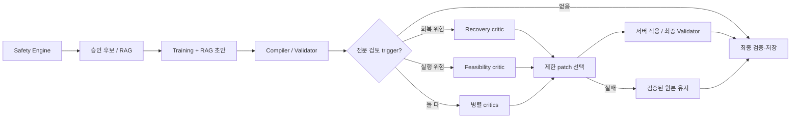

# Round 3 Multi-Agent 표적 반복 평가 결과

- 실행일: 2026-09-15
- 브랜치: `test/multi-agent-round3`
- 대상: `expanded_heldout_cases`의 conflict/complex planning case 28건
- 반복: architecture별 3회, 총 168 run
- 비교: B. Single-Agent+RAG / C. Multi-Agent+RAG
- 모델: `OPENAI:gpt-5.6-terra:reasoning-low`
- Judge: 미실행
- 호출 하드 스톱: 480회
- 실제 호출: 417회
- 산출물: `results/round3/conflict_complex_r3_paid_20260915/`

Round 2 공식 판정을 소급 변경하지 않는 후속 표적 평가다. 같은 dataset, 모델, 카탈로그, 정책,
compiler, integrity validator와 fallback을 사용했다. AWS Secrets Manager의 API key는 실행 프로세스
환경에만 주입했으며 파일·로그·산출물에 저장하지 않았다.

## 결과 요약

| 지표 | Single-Agent+RAG | Multi-Agent+RAG |
|---|---:|---:|
| run | 84 | 84 |
| 모델 직접 계획 | 81 (0.9643) | 73 (0.8690) |
| 모델 직접 계획 Wilson 95% CI | 0.9002~0.9878 | 0.7805~0.9253 |
| fallback 계획 | 3 | 11 |
| 계획 전달 | 84/84 (1.000) | 84/84 (1.000) |
| Safety Compliance | 1.000 | 1.000 |
| Workflow Success | 1.000 | 1.000 |
| Constraint Satisfaction (현행 정책 정정) | 1.000 | 1.000 |
| Critical failure | 0 | 0 |
| P50 latency | 19.532초 | 24.421초 |
| P95 latency | 38.563초 | 40.734초 |
| 호출 수 | 84 | 333 |
| 평균 token/run | 9,822.0 | 24,737.3 |

두 architecture의 모델 직접 계획을 같은 case·repeat 순서로 짝지으면 B 승 11, C 승 3, 동률
70이었다. decisive pair에서 B 승률은 0.7857이고 Wilson 95% CI는 0.5241~0.9243이다. 표본상 B가
앞섰지만 decisive pair가 14개뿐이므로 효과 크기를 확정값으로 일반화하지 않는다.

category별 모델 직접 계획률은 다음과 같다.

| Category | Single-Agent+RAG | Multi-Agent+RAG |
|---|---:|---:|
| complex (48 run) | 0.9792 | 0.8333 |
| conflict (36 run) | 0.9444 | 0.9167 |

## 반복 변동

| Architecture | 1회차 | 2회차 | 3회차 |
|---|---:|---:|---:|
| Single-Agent+RAG 직접 계획 | 27/28 | 28/28 | 26/28 |
| Multi-Agent+RAG 직접 계획 | 24/28 | 22/28 | 27/28 |

Multi-Agent의 직접 계획률은 0.7857~0.9643 범위로 흔들렸다. `SQ-HELD-022`는 처음 두 반복에서
specialist 단계 fallback이었지만 세 번째 반복에서는 직접 통과했다. 단일 실행만으로 architecture를
판정하면 안 된다는 Round 2 결론을 재확인한다.

## 실패 단계와 지연

Single-Agent의 모델 직접 계획 실패는 contract 1건, deterministic gate 2건이었다. Multi-Agent의
11건은 모두 contract 계열로 분류됐으며 invocation audit와 downstream consequence를 함께 세면
Training 5, Coordinator initial 5, Coordinator repair 1, compiler/PlanSpec absence 6, integrity 2가
관측됐다. 단계 수는 하나의 run에 중복될 수 있으므로 합계가 fallback 11건과 같지 않다.

Multi-Agent 역할별 provider 지연은 다음과 같다.

| 역할/phase | 호출 | 실패 | P50 | P95 |
|---|---:|---:|---:|---:|
| Training/Propose | 84 | 5 | 16.984초 | 30.437초 |
| Recovery/Propose | 84 | 0 | 2.703초 | 3.672초 |
| Feasibility/Propose | 84 | 0 | 2.672초 | 3.953초 |
| Coordinator/Initial | 79 | 5 | 6.922초 | 16.406초 |
| Coordinator/Repair | 2 | 1 | 11.296초 | 20.641초 |

전체 Multi P95 40.734초는 사전 기준 30초를 넘었다. Training P95만 30.437초이고 Recovery와
Feasibility는 병렬이므로, 후속 지연 개선은 Training 출력 안정화·payload와 Coordinator 호출 경로를
우선 검토해야 한다. 조건부 advisory 호출은 ADR-0015 구조 변경이므로 별도 승인 없이 구현하지 않는다.

## 평가 데이터 정정

`SQ-HELD-044`의 `prohibited_equipment_codes=[DUMBBELL]` 조건은 2026-08-27 승인된 장비 비게이트
정책과 충돌하는 오래된 평가 조건이었다. 덤벨 운동 포함은 서비스 결함이 아니며
`PROHIBITED_EQUIPMENT_REQUIRED` finding은 판정에서 제외한다. 같은 원천에서 생성된 장비 금지
시나리오는 후속 `heldout_cases_v2`·`expanded_heldout_cases_v2`에서 장비 보유 정보 없는
장소·시간 시나리오로 교체했다. 과거 실행의 원본 dataset과 manifest는 재현성을 위해 보존한다.

정책에 맞게 해석하면 B와 C의 Constraint Satisfaction은 모두 1.000이다. 이 정정은 이미 저장된
모델 출력, 직접 계획/fallback 분류, 지연, 호출 수와 토큰을 바꾸지 않으므로 아키텍처 우월성 판정에는
영향이 없다.

## 비용

실측 token은 입력 2,530,257, 출력 372,732였다. 2026-07-30 이후 공식 GPT-5.6 Terra 표준 가격
입력 $2/1M, 출력 $12/1M을 적용한 계산 비용은 **$9.5333**이다. cached-input 할인은 반영하지 않아
보수적인 계산이며 승인 한도 $40의 23.8%다. 가격 근거는 같은 산출물 디렉터리의
`pricing_reference.json`에 고정했다.

## 판정

- 안전·전달: 두 architecture 모두 Safety 1.000, Plan Delivery 1.000, critical 0으로 유지했다.
- 지연: 두 architecture 모두 30초 P95 기준 미달이며 Multi가 2.171초 느렸다.
- 직접 계획: B가 전체·complex·conflict 모두 C 이상이었다.
- 비용: Multi는 B 대비 호출 3.96배, 평균 token/run 2.52배였다.
- 평가 정정: 금지 장비 finding은 현행 정책과 충돌해 제외했으며 정책 기준 Constraint는 양쪽 1.000이다.

따라서 Round 3도 Multi-Agent의 Single-Agent+RAG 대비 우월성을 지지하지 않는다. 현 증거에서는
Single-Agent+RAG가 비용·지연·직접 계획 안정성에서 우세하고, Multi-Agent는 안전 또는 전달률의 추가
이점을 보이지 않았다. 현 구조 승격은 보류하고 ADR-0025의 후보 생성·교차 검토·제한 조정 실험으로
별도 재평가한다.

## 후속 구조 실험: D와 E

Round 3의 B/C 반복 평가 뒤에는 멀티에이전트가 실제로 개입할 수 있는 범위를 좁혀 두 가지 구조를
추가로 탐색했다. 두 실험 모두 평가 코드와 결과만 변경했으며 공개 API, DB 스키마, 운영 LangGraph,
안전 정책과 운영 prompt는 변경하지 않았다.

| 구조 | 설계 | 관측 결과 | 판정 |
|---|---|---|---|
| D. 후보 생성–교차 검토–제한 조정 | Training이 후보 2개를 만들고 Recovery·Feasibility가 교차 검토한 뒤 제한적으로 선택·조정 | pre-gate 표본에서 B 직접 계획 3/3, D 직접 계획 1/3. simple 1건에서는 reviewer 이견과 후보 변경이 발생했으나 complex·conflict에서 후보 2개 생성이 병목 | 개입 가능성은 확인했지만 안정성과 품질 우위는 미입증 |
| E. 단일 초안–병렬 critic–제한 patch | B가 만든 유효한 초안 하나를 Recovery·Feasibility가 검토하고 Coordinator는 제출된 patch만 채택 | 동일 초안 8건에서 B/E 모두 직접 계획 8/8, E 변경 0/8. 4건은 `NO_CHANGE`, 4건은 critic schema 실패 후 원본 보존 | no-regression은 확인했지만 품질 개선 증거 없음 |

D 산출물의 기록 비용 하한은 약 `$0.745590`, E의 저장된 세 산출물 비용 하한은 `$0.718472`다.
공용 retry telemetry가 첫 시도의 사용량을 모두 보존하지 않고 E의 중단 실행 한 건은 산출물이 없으므로
invoice 총액으로 해석하지 않는다. 상세 원본은
[`results/candidate-review-pilot/`](../../results/candidate-review-pilot/README.md)와
[`results/single-draft-review-pilot/`](../../results/single-draft-review-pilot/README.md)에 있다.

## 해석: Safety Engine과 RAG가 멀티에이전트의 차이를 좁혔는가

그렇게 해석할 수 있다. 다만 이는 사후 설명에 가까우며, 독립적인 인과 실험으로 증명한 결론은 아니다.
현 구조에서는 `SafetyPolicyEngine`과 PostgreSQL 승인 필터가 생성 가능 여부·제외 운동·부담 상한을
결정하고, RAG가 승인된 후보 안에서 검색 범위를 좁힌다. 이후 compiler와 integrity validator가 시간,
카탈로그, 안전 제약을 다시 강제한다. 따라서 LLM specialist가 합법적으로 바꿀 수 있는 결정 공간이
이미 작고, 동일한 입력과 목표를 받은 Recovery·Feasibility의 의견도 Training과 중복되기 쉽다.

이 결과는 결정적 안전 계층이나 RAG를 약화해야 한다는 뜻이 아니다. 안전 veto와 승인 자격은 계속
규칙 기반이어야 한다. 현재 데이터가 말하는 것은 **여러 Agent가 항상 호출되어 계획 생성에 함께
참여하는 방식의 추가 가치가 관측되지 않았다**는 점이다.

## 그럼에도 멀티에이전트 구조를 유지하는 이유

유지 근거는 현재의 운동 루틴 품질 우위가 아니라 다음의 구조적 가치다.

1. **책임 분리와 감사 가능성:** Training의 계획, Recovery·Feasibility의 위험 의견, Coordinator의
   선택을 별도 proposal로 저장하면 어떤 관점이 무엇을 바꾸려 했는지 추적할 수 있다.
2. **독립 검토 경계:** 회복과 실행 가능성에 실제로 다른 데이터와 판정 기준이 생길 때, 한 prompt를
   계속 키우지 않고 독립적으로 검증하고 실패를 격리할 수 있다.
3. **제한된 개입:** specialist가 완성 계획을 다시 쓰지 않고 typed adjustment 또는 허용된 patch만
   제안하게 하면 결정적 안전 계층을 침범하지 않으면서 이견을 표현할 수 있다.
4. **점진적 확장:** 향후 Recovery에는 최근 7일 부하·연속 운동일·피로 추세, Feasibility에는 실제
   완료 시간·중단 위치·전환 실패, Training에는 목표 자극·주간 split·점진적 과부하처럼 서로 다른
   신호를 제공해 역할별 기여를 측정할 수 있다.

따라서 외부에 주장할 수 있는 문장은 “멀티에이전트가 더 좋은 루틴을 만든다”가 아니라,
“결정적 안전 계층 위에서 전문 관점의 독립 검토와 변경 이력을 분리할 수 있는 구조를 유지한다”이다.
B는 현 시점의 품질·안정성·비용 기준선이자 기본 계획 생성기로 본다.

## 권장 목표 구조와 검증 조건

다음 구조는 Round 3에서 우월성이 검증된 운영 구조가 아니라, 후속 실험 대상으로 권장하는 방향이다.

정상 사례에는 critic을 호출하지 않는다. 회복 상한 경계, 낮은 회복 상태와 높은 예정 부하의 충돌,
요청 시간 허용 범위 경계, 높은 동작 전환 복잡도, 반복된 미완료·특정 위치 중단처럼 서버가 재현할 수
있는 조건에서만 관련 specialist를 호출한다. 장비 보유 여부는 trigger나 조정 조건으로 사용하지 않는다.

다음 평가에서는 먼저 trigger의 precision/recall과 critic의 유효 patch 제안률을 측정한다. 그 다음
변경된 pair에 한해서 blind 사람 평가 또는 사전 고정 judge를 실시하고, 안전·제약 준수율 100%와
원본 보존을 필수 gate로 둔다. 품질 효과와 함께 p95 지연, 호출 수, token/run, schema 실패율을
보고해야 한다. 이 조건을 통과하기 전에는 조건부 구조가 B보다 낫다고 주장하거나 운영 경로로
승격하지 않는다.
