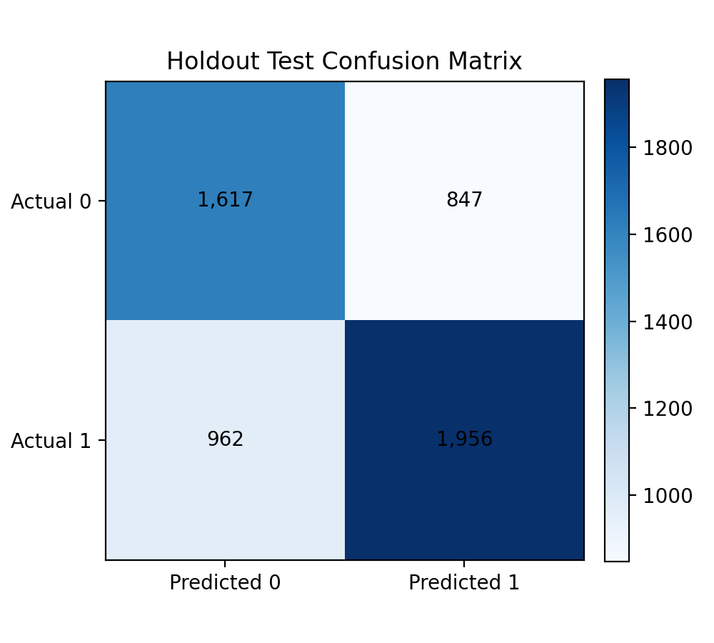
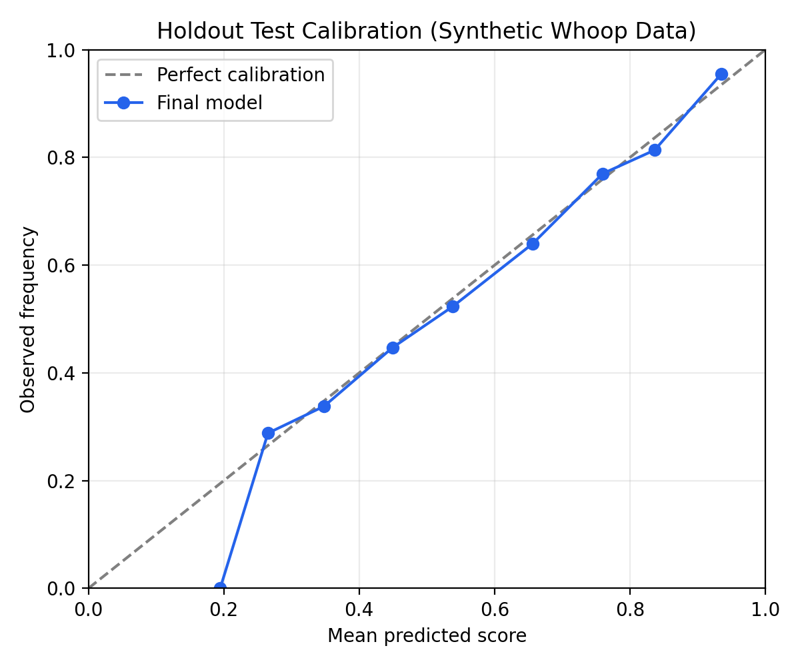

# ML 학습 결과서

> 최종 상태: 오프라인 분석 완료. validation PR-AUC로 선정한 `A3` HistGradientBoosting Pipeline이다. 합성 데이터 기반 분석 자료이며 제품 런타임, 운동 강도 결정, 공식 수행 판정에 사용하지 않는다.

## 1. 과제 정의

목표는 합성 웨어러블·운동 이력의 전일까지 정보만 사용해 당일의 운동 기록 존재 여부를 예측하고, 정보 블록의 추가 기여도와 어떤 사용자 구간에서 작동하는지 확인하는 것이다.

- 타깃: `workout_completed` (`1` = 해당 날짜의 운동 기록 존재, `0` = 기록 없음)
- 추론 범위: 전일까지만 사용하며 제품 런타임·알림·에이전트 의사결정에 연결하지 않음
- 타깃 한계: 제품의 공식 수행 상태 `COMPLETED` / `PARTIAL` / `NOT_COMPLETED`를 대표하지 않는다. 이진 타깃은 활동 발생 여부만 다루며 `PARTIAL`을 표현하지 못한다.

## 2. 데이터

| 항목 | 내용 |
|---|---|
| 출처 | [Whoop Fitness Dataset 100K](https://www.kaggle.com/datasets/likithagedipudi/whoop-fitness-dataset) |
| 라이선스 | CC0: Public Domain |
| 취득일 | 2026-08-20 |
| 성격 | 합성 Kaggle 데이터셋. 실사용자 데이터가 아님 |
| 규모 | 100,000행, 286명, 39개 원본 컬럼 |
| 기간 | 2023-01-01 ~ 2024-02-03 |
| 원본 SHA-256 | `094fa329dd2bd886dd72bf2d5b615d5d901516c7a4f4a020d112e0a48de4dd1c` |

다른 데이터셋이나 실사용자 데이터를 추가하지 않았다.

## 3. 라벨 구조

| 지표 | 실측값 |
|---|---:|
| 운동 기록 존재 비율 | 0.5401 |
| lag-1 상관 | 0.155 |
| P(기록=1 \| 전일 기록=1) | 0.612 |
| P(기록=1 \| 전일 기록=0) | 0.457 |
| 평일 기록 비율 | 0.586 ~ 0.591 |
| 주말 기록 비율 | 토 0.418 / 일 0.417 |

요일 주기성과 이력이 관측되었으나, 합성 생성기의 파라미터일 수 있으므로 한국 사용자 행동의 근거로 사용하지 않는다.

## 4. 전처리

파이프라인은 `user_id + local_date` 순서 정렬, 당일 결과성 컬럼 제외, 전일값 `shift(1)`, 7일·28일 이력, 직전 28일 개인 기준선 대비 피처, 결측 처리를 포함한 sklearn `Pipeline`으로 구성되었다.

- 결측: 과거 관측값만 사용한다. 원본에는 제외 대상인 `workout_time_of_day` 외에 결측이 없다. 첫 관측의 직전값이 없으면 결측으로 남긴다.
- 누수 차단: 당일 `activity_*`, `avg_heart_rate`, `max_heart_rate`, `hr_zone_*`, `workout_time_of_day`, `day_strain`, `calories_burned`, 전기간 상수 `hrv_baseline`, `rhr_baseline`을 입력에서 제외했다.
- 개인 기준선: `hrv_baseline`/`rhr_baseline`을 사용하지 않고, 직전 28일의 과거값만으로 직접 계산했다.
- 안정심박 추세: `resting_hr_delta_28d >= 2.0` = `UPWARD`, `<= -2.0` = `DOWNWARD`, 나머지 = `STABLE`. 이는 ML 임시 규칙 v0.1이며 의학적 기준이 아니다.
- 경험 코드: `Elite`는 제품 코드와 맞추어 `ADVANCED`로 병합했다.

2026-08-20에 `validate_leakage.py`를 6개 분할 파일에 모두 실행하여 각각 39개 처리 컬럼과 22개 제외 컬럼의 교집합이 비어 있음을 확인했다.

## 5. 분할

무작위로 분할하지 않았다. 시간 분할은 날짜 순서로 과거 70% / 다음 15% / 마지막 15%, 사용자 분할은 사용자 그룹이 겹치지 않도록 70% / 15% / 15%로 나눴다.

| 분할 | 구간 | 행 | 사용자 | 날짜 범위 |
|---|---|---:|---:|---|
| 시간 | train | 79,652 | 286 | 2023-01-01 ~ 2023-10-06 |
| 시간 | validation | 14,966 | 285 | 2023-10-07 ~ 2023-12-05 |
| 시간 | test | 5,382 | 168 | 2023-12-06 ~ 2024-02-03 |
| 사용자 | train | 69,956 | 200 | 2023-01-01 ~ 2024-02-03 |
| 사용자 | validation | 15,088 | 43 | 2023-01-01 ~ 2024-02-02 |
| 사용자 | test | 14,956 | 43 | 2023-01-01 ~ 2024-02-01 |

모델 선정과 하이퍼파라미터 확정에는 validation만 사용했다. 최종 test는 동결된 시간 분할 후보에 대해 1회만 평가했고, 이후 재선정을 금지했다. 사용자 기반 test는 제출 모델의 최종 평가에 사용하지 않았다.

## 6. 실험 설계

| ID | 피처 블록 | 용도 |
|---|---|---|
| A0 | 없음 | 다수 클래스 기준선 |
| A1 | 경험·달력 | 콜드스타트 참조선 |
| A2-lag1 | 전일 기록 + 요일 | 자기상관 참조선 |
| A2 | A1 + 운동 이력 | 앱이 직접 기록 |
| A3 | A2 + 서비스 수집 가능 웨어러블 | 핵심 비교 A2 → A3 |
| A4 | A3 + 28일 개인 기준선 대비 | 인과적 롤링 |
| A5 | A4 + 서비스 미수집 항목 | 탐색 전용. 최종 후보 제외 |

실험 매트릭스는 2개 분할 × (`A0` 1회 + 6개 ablation × 3개 모델) = validation 38회다. 모델은 Logistic Regression, Random Forest, HistGradientBoosting을 사용했고 시드는 `42`로 고정했다. 하이퍼파라미터는 설정된 기본값을 사용했다.

## 7. 결과

### 7.1 Validation 전체 성능표

아래 표는 ablation별 최고 PR-AUC 모델이다. 전체 수치는 [experiments.csv](../outputs/experiments.csv)에 보존한다.

| 분할 | Ablation | 모델 | Precision | Recall | F1 | ROC-AUC | PR-AUC | Brier |
|---|---|---|---:|---:|---:|---:|---:|---:|
| 시간 | A0 | majority | 0.536215 | 1.000000 | 0.698099 | 0.500000 | 0.536215 | 0.463785 |
| 시간 | A1 | logreg | 0.741153 | 0.563738 | 0.640385 | 0.713440 | 0.723155 | 0.212386 |
| 시간 | A2-lag1 | logreg | 0.586308 | 0.747040 | 0.656986 | 0.615473 | 0.623732 | 0.238881 |
| 시간 | A2 | histgb | 0.697407 | 0.656822 | 0.676506 | 0.727682 | 0.763004 | 0.208780 |
| 시간 | A3 | histgb | 0.699037 | 0.651215 | 0.674279 | 0.728009 | **0.764349** | 0.208651 |
| 시간 | A4 | histgb | 0.699467 | 0.654579 | 0.676279 | 0.728115 | 0.763812 | 0.208702 |
| 시간 | A5 | histgb | 0.699546 | 0.652212 | 0.675050 | 0.727733 | 0.764113 | 0.208807 |
| 사용자 | A0 | majority | 0.549377 | 1.000000 | 0.709159 | 0.500000 | 0.549377 | 0.450623 |
| 사용자 | A1 | rf | 0.714368 | 0.599831 | 0.652108 | 0.702416 | 0.714465 | 0.214942 |
| 사용자 | A2-lag1 | histgb | 0.640805 | 0.564966 | 0.600500 | 0.613312 | 0.628200 | 0.236640 |
| 사용자 | A2 | logreg | 0.670282 | 0.730607 | 0.699146 | 0.715788 | **0.745179** | 0.213389 |
| 사용자 | A3 | logreg | 0.670231 | 0.726022 | 0.697012 | 0.715122 | 0.745122 | 0.213490 |
| 사용자 | A4 | logreg | 0.670722 | 0.724937 | 0.696776 | 0.715120 | 0.745015 | 0.213487 |
| 사용자 | A5 | logreg | 0.671080 | 0.727591 | 0.698194 | 0.715233 | 0.744647 | 0.213474 |

시간·사용자 validation의 분할별 후보 모델은 각각 `A3` HistGradientBoosting과 `A2` Logistic Regression이다. 전역 후보는 동결 규칙에 따라 두 분할 전체 중 가장 높은 validation PR-AUC 0.764348695인 `time_A3_histgb`로 확정했다. 서비스 미수집 피처인 `A5`는 최종 후보에서 제외했다.

### 7.2 Validation 전체 실험표

| 실험 ID | Precision | Recall | F1 | ROC-AUC | PR-AUC | Brier |
|---|---:|---:|---:|---:|---:|---:|
| time_A0_majority | 0.536215 | 1.000000 | 0.698099 | 0.500000 | 0.536215 | 0.463785 |
| time_A1_logreg | 0.741153 | 0.563738 | 0.640385 | 0.713440 | 0.723155 | 0.212386 |
| time_A1_rf | 0.741153 | 0.563738 | 0.640385 | 0.711629 | 0.720021 | 0.211651 |
| time_A1_histgb | 0.741153 | 0.563738 | 0.640385 | 0.711442 | 0.719845 | 0.211655 |
| time_A2_logreg | 0.685907 | 0.684112 | 0.685008 | 0.727788 | 0.762113 | 0.209633 |
| time_A2_rf | 0.679841 | 0.660187 | 0.669870 | 0.709456 | 0.747610 | 0.216238 |
| time_A2_histgb | 0.697407 | 0.656822 | 0.676506 | 0.727682 | 0.763004 | 0.208780 |
| time_A3_logreg | 0.687139 | 0.681745 | 0.684431 | 0.728021 | 0.762272 | 0.209558 |
| time_A3_rf | 0.692773 | 0.655826 | 0.673793 | 0.721466 | 0.758668 | 0.210882 |
| time_A3_histgb | 0.699037 | 0.651215 | 0.674279 | 0.728009 | 0.764349 | 0.208651 |
| time_A4_logreg | 0.687311 | 0.680374 | 0.683825 | 0.728058 | 0.762330 | 0.209549 |
| time_A4_rf | 0.697693 | 0.659439 | 0.678027 | 0.724141 | 0.760403 | 0.210019 |
| time_A4_histgb | 0.699467 | 0.654579 | 0.676279 | 0.728115 | 0.763812 | 0.208702 |
| time_A5_logreg | 0.686935 | 0.681371 | 0.684141 | 0.728106 | 0.762183 | 0.209533 |
| time_A5_rf | 0.697490 | 0.647601 | 0.671621 | 0.724741 | 0.761186 | 0.209511 |
| time_A5_histgb | 0.699546 | 0.652212 | 0.675050 | 0.727733 | 0.764113 | 0.208807 |
| time_A2-lag1_logreg | 0.586308 | 0.747040 | 0.656986 | 0.615473 | 0.623732 | 0.238881 |
| time_A2-lag1_rf | 0.637488 | 0.559003 | 0.595671 | 0.617395 | 0.620876 | 0.236874 |
| time_A2-lag1_histgb | 0.637488 | 0.559003 | 0.595671 | 0.617966 | 0.621609 | 0.236889 |
| user_A0_majority | 0.549377 | 1.000000 | 0.709159 | 0.500000 | 0.549377 | 0.450623 |
| user_A1_logreg | 0.714368 | 0.599831 | 0.652108 | 0.700572 | 0.710781 | 0.215530 |
| user_A1_rf | 0.714368 | 0.599831 | 0.652108 | 0.702416 | 0.714465 | 0.214942 |
| user_A1_histgb | 0.714368 | 0.599831 | 0.652108 | 0.702313 | 0.712173 | 0.214920 |
| user_A2_logreg | 0.670282 | 0.730607 | 0.699146 | 0.715788 | 0.745179 | 0.213389 |
| user_A2_rf | 0.671434 | 0.685366 | 0.678328 | 0.695787 | 0.724571 | 0.220801 |
| user_A2_histgb | 0.686821 | 0.686573 | 0.686697 | 0.714757 | 0.742732 | 0.213178 |
| user_A3_logreg | 0.670231 | 0.726022 | 0.697012 | 0.715122 | 0.745122 | 0.213490 |
| user_A3_rf | 0.677199 | 0.682591 | 0.679885 | 0.707669 | 0.736976 | 0.215409 |
| user_A3_histgb | 0.683279 | 0.679817 | 0.681543 | 0.713606 | 0.742169 | 0.213407 |
| user_A4_logreg | 0.670722 | 0.724937 | 0.696776 | 0.715120 | 0.745015 | 0.213487 |
| user_A4_rf | 0.677784 | 0.686452 | 0.682091 | 0.708041 | 0.736706 | 0.215216 |
| user_A4_histgb | 0.682064 | 0.685849 | 0.683951 | 0.713457 | 0.741197 | 0.213497 |
| user_A5_logreg | 0.671080 | 0.727591 | 0.698194 | 0.715233 | 0.744647 | 0.213474 |
| user_A5_rf | 0.679076 | 0.684401 | 0.681728 | 0.710746 | 0.737361 | 0.214326 |
| user_A5_histgb | 0.683152 | 0.688262 | 0.685697 | 0.714532 | 0.743625 | 0.213120 |
| user_A2-lag1_logreg | 0.594014 | 0.747014 | 0.661786 | 0.606531 | 0.626318 | 0.239192 |
| user_A2-lag1_rf | 0.640805 | 0.564966 | 0.600500 | 0.613053 | 0.627911 | 0.236649 |
| user_A2-lag1_histgb | 0.640805 | 0.564966 | 0.600500 | 0.613312 | 0.628200 | 0.236640 |

### 7.3 최종 모델 test 성능

| 모델 | 임계값 | 표본 | Precision | Recall | F1 | ROC-AUC | PR-AUC | Brier |
|---|---:|---:|---:|---:|---:|---:|---:|---:|
| A3 HistGradientBoosting | 0.5 | 5,382 | 0.697824 | 0.670322 | 0.683797 | 0.726203 | 0.766122 | 0.209051 |

최종 모델은 development(train + validation) 94,618행으로 재학습한 다음, 동결 후보의 시간 test에서 1회 평가했다. 혼동행렬은 TN 1,617, FP 847, FN 962, TP 1,956이다.

## 8. 세그먼트 분석

### 8.1 이력 길이별

최종 test의 시간 분할은 모두 `29+`에 해당해 콜드스타트 비교가 불가능하다. 대신 사용자 validation에서 `user_A2_logreg`의 이력 구간을 확인했다.

| 이력 구간 | 표본 | Precision | Recall | F1 | ROC-AUC | PR-AUC | Brier |
|---|---:|---:|---:|---:|---:|---:|---:|
| 0-7 | 344 | 0.633166 | 0.673797 | 0.652850 | 0.660138 | 0.691101 | 0.230519 |
| 8-28 | 903 | 0.646853 | 0.744467 | 0.692236 | 0.685138 | 0.713714 | 0.222825 |
| 29+ | 13,841 | 0.672798 | 0.731098 | 0.700737 | 0.718919 | 0.747986 | 0.212347 |

이 실험에서는 0-7일 구간의 표본이 344행으로 작다. 이 지표를 제품 의사결정의 근거로 사용하지 않는다.

### 8.2 경험 세그먼트

| 경험 코드 | 표본 | Precision | Recall | F1 | ROC-AUC | PR-AUC | Brier |
|---|---:|---:|---:|---:|---:|---:|---:|
| BEGINNER | 1,145 | 0.000000 | 0.000000 | 0.000000 | 0.566552 | 0.385304 | 0.218584 |
| INTERMEDIATE | 1,914 | 0.551440 | 0.316038 | 0.401799 | 0.607304 | 0.529322 | 0.238541 |
| ADVANCED | 2,323 | 0.728528 | 0.998226 | 0.842315 | 0.690076 | 0.852781 | 0.180054 |

이는 최종 시간 test 결과다. 0.5 임계값에서 BEGINNER 구간의 양성 판정이 0건으로 나타나 집단 간 편차가 확인되었다. 자체 데이터 검증 없이 이 모델을 실제 운영에 연결하면 안 된다.

### 8.3 A2 → A3 비교

| 분할 | 모델 | A2 PR-AUC | A3 PR-AUC | 차이 |
|---|---|---:|---:|---:|
| 시간 | histgb | 0.763004 | 0.764349 | +0.001345 |
| 사용자 | logreg | 0.745179 | 0.745122 | -0.000057 |

동일 모델을 기준으로 비교할 때 서비스 수집 가능 웨어러블의 추가 기여도는 매우 작게 관측되었다. 웨어러블 결측이 없으므로 웨어러블 유무 세그먼트는 만들 수 없다. 이 합성 데이터셋에서는 서비스 수집 웨어러블의 뚜렷한 추가 기여가 관측되지 않았다.

## 9. Calibration

최종 test Brier는 0.209051이다. 출력은 합성 데이터 기준 수행 성향 점수로만 해석한다. 실사용자 확률이나 의료적 확률로 해석하지 않으며 시스템 의사결정에 연결하지 않는다.

구간별 수치는 [calibration_curve.csv](../outputs/final/calibration_curve.csv), 그림은 [calibration_curve.png](../outputs/final/calibration_curve.png)에 있다.

## 10. 해석

최종 Pipeline의 test permutation PR-AUC importance 상위 항목은 다음과 같다.

| 피처 | 평균 중요도 | 표준편차 |
|---|---:|---:|
| `experience_level_code` | 0.101736 | 0.003152 |
| `day_of_week` | 0.052646 | 0.001574 |
| `completion_rate_28d` | 0.019906 | 0.004387 |
| `workout_count_28d` | 0.007040 | 0.001727 |
| `last_workout_calories_prev_day` | 0.000530 | 0.000250 |
| `last_workout_type_code_prev_day` | 0.000449 | 0.000217 |
| `last_workout_duration_min_prev_day` | 0.000406 | 0.000112 |

직접 전일 기록 피처의 importance는 0에 가까웠지만, 28일 비율·건수는 관측되었다. 시간 validation에서 A2-lag1의 최고 PR-AUC 0.623732가 A3 0.764349보다 낮아 단순 자기상관 참조선을 넘어섰다. 다만 이 수치들은 합성 생성 규칙의 반영일 수 있으며, 실사용자 행동의 근거로 사용하지 않는다.

참고로 `time_A3_logreg` validation의 계수는 다음과 같다. 수치형은 표준화되었고 범주형은 원-핫 인코딩되었으므로 서로 다른 유형의 계수 절대값을 직접 비교하지 않는다.

| 피처 | LR 계수 |
|---|---:|
| `experience_level_code_ADVANCED` | 0.685991 |
| `experience_level_code_BEGINNER` | -0.476590 |
| `is_weekend` | -0.361164 |
| `completion_rate_28d` | 0.339610 |
| `days_since_last_workout` | -0.211930 |
| `consecutive_non_workout_days` | 0.197689 |
| `experience_level_code_INTERMEDIATE` | -0.150247 |

## 11. 한계

- 이 결과는 합성 생성 규칙을 반영할 수 있으며 실사용자 제품 성능을 보장하지 않는다.
- 타깃은 해당 날짜의 운동 기록 존재 여부만 나타내며 제품의 3가지 공식 수행 상태 중 `PARTIAL`이 소실되었다.
- 데이터셋에 웨어러블 결측이 없어 가용성 플래그와 웨어러블 유무 세그먼트를 만들 수 없다. A2 → A3 비교가 이 질문을 대신한다.
- 제품에는 있지만 Whoop 원본에는 `steps`, `active_minutes`, `fatigue_level_code`, `requested_duration_minutes`가 없다. A5의 HRV·recovery·수면 세부 피처는 서비스 미수집이라 최종 후보에서 제외했다.
- 시간 validation/test에는 `history_bucket=29+`만 나타나 콜드스타트 지표가 제한적이다. 이력 구간 결과는 사용자 validation만 제시했고 0-7일 표본이 작다.
- 경험 구간별 성능 편차가 크다. 하나의 0.5 임계값을 제품 운영에 적용해서는 안 된다.
- 최종 test는 1회만 사용했다. 수치를 보고 선정하거나 모델을 바꾸며 test를 재차 조회하지 않는다.

## 12. 결론과 향후 과제

합성 데이터의 시간·사용자 validation에서 직접 운동 이력 블록이 다수 클래스·자기상관 참조선을 넘어섰다. 다만 서비스 수집 웨어러블 추가 기여는 앱 이력 대비 두 분할에서 거의 없었다.

다음 단계는 자체 실사용자 데이터로 3가지 공식 수행 상태를 재구축하고, 콜드스타트·경험 구간별 공정성 지표를 사전 등록한 다음 calibration을 다시 검증하는 것이다. 합성 데이터 기준 수행 성향 점수를 제품 런타임에 연결하려면 계약 변경과 개발 리드 승인이 선행되어야 한다.

## 출처

- [ML_WORK_PLAN.md](../docs/ML_WORK_PLAN.md)
- [FEATURE_SPEC.md](../docs/FEATURE_SPEC.md)
- [experiments.yaml](../config/experiments.yaml)
- [final_model.yaml](../config/final_model.yaml)
- [final_metrics.json](../outputs/final/final_metrics.json)
- [FINAL_VERIFICATION.md](FINAL_VERIFICATION.md)
- [Whoop Fitness Dataset](https://www.kaggle.com/datasets/likithagedipudi/whoop-fitness-dataset)
